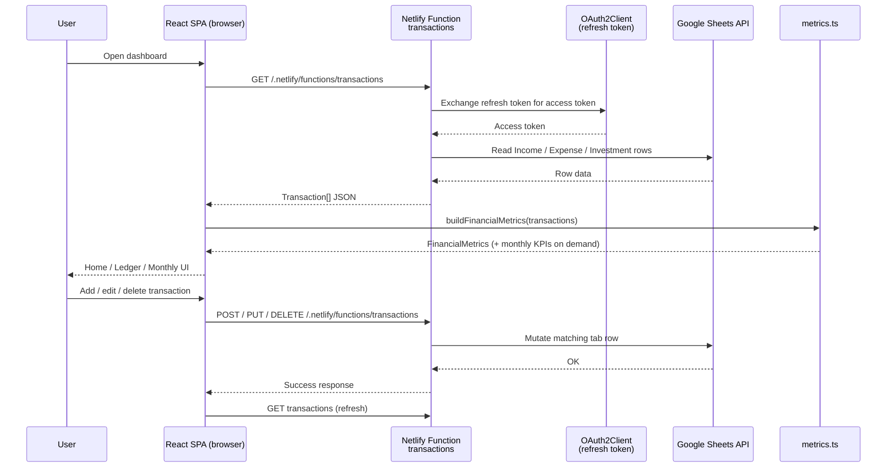

# Muffin

A personal finance Progressive Web App (**Muffin**) that turns a Google Sheet into a live dashboard. Track income, expenses, and investments in three familiar spreadsheet tabs; a Netlify-hosted React app connects to that workbook via the Google Sheets API, computes savings and net-worth metrics, and presents them in a warm, mobile-first UI you can install on your phone — and edit right from the app.

Think of it as baking your money muffins: sheet data goes in, and Home serves up KPIs, charts, and a ledger you can manage on the go.

---

## Table of Contents

- [1. What This App Does (Functional Description)](#1-what-this-app-does-functional-description)
  - [1.1 Purpose and audience](#11-purpose-and-audience)
  - [1.2 Data model](#12-data-model)
  - [1.3 How investments are treated](#13-how-investments-are-treated)
  - [1.3.1 Provident Fund (display-only)](#131-provident-fund-display-only)
  - [1.4 Metrics the dashboard computes](#14-metrics-the-dashboard-computes)
  - [1.5 Views and features](#15-views-and-features)
  - [1.6 Everyday data flow](#16-everyday-data-flow)
  - [1.7 Where data lives](#17-where-data-lives)
  - [1.8 Limitations](#18-limitations)
- [2. Setup Tutorial (Non-Developer Friendly)](#2-setup-tutorial-non-developer-friendly)
  - [2.1 Prerequisites](#21-prerequisites)
  - [2.2 Create your Google Sheet workbook](#22-create-your-google-sheet-workbook-single-book-three-tabs)
  - [2.3 Create a Google Cloud project and OAuth credentials](#23-create-a-google-cloud-project-and-oauth-credentials)
  - [2.4 Generate a refresh token](#24-generate-a-refresh-token)
  - [2.5 Get the project onto GitHub](#25-get-the-project-onto-github)
  - [2.6 Deploy on Netlify](#26-deploy-on-netlify)
  - [2.7 Configure environment variables](#27-configure-environment-variables-in-netlify)
  - [2.8 Optional: run locally](#28-optional-run-locally)
  - [2.9 Optional: customize starting balances](#29-optional-customize-starting-balances--currency)
  - [2.10 Everyday usage](#210-everyday-usage)
  - [2.11 Troubleshooting](#211-troubleshooting)
- [3. Technical Solution (For Developers)](#3-technical-solution-for-developers)
  - [3.1 Tech stack](#31-tech-stack)
  - [3.2 Repository architecture](#32-repository-architecture)
  - [3.3 Runtime architecture and data flow](#33-runtime-architecture-and-data-flow)
  - [3.4 Domain model and API](#34-domain-model-and-api)
  - [3.5 Metrics engine](#35-metrics-engine)
  - [3.6 Frontend application structure](#36-frontend-application-structure)
  - [3.7 PWA behavior](#37-pwa-behavior)
  - [3.8 Deployment and environments](#38-deployment-and-environments)
  - [3.9 Security and privacy](#39-security-and-privacy)
  - [3.10 Extensibility](#310-extensibility)
  - [3.11 AI-assisted development](#311-ai-assisted-development)
- [4. Credits](#4-credits)

---

## 1. What This App Does (Functional Description)

### 1.1 Purpose and audience

This project is a **personal finance dashboard** for individuals who already (or prefer to) track money in Google Sheets. Instead of building formulas and charts inside the spreadsheet alone, you keep a simple ledger in Sheets and open a phone-friendly web app that shows:

- This month's income, spending, and investments
- Liquid cash vs invested savings
- Net worth and growth since you started tracking
- Investment breakup (top types on Home; full pie on tap)
- Provident Fund totals on their own More Details card (not in net worth or investment breakup)
- Month-by-month trends and category breakdowns
- A planner for "what if I spend/save this?" scenarios without editing the real sheet
- In-app add / edit / delete for sheet transactions, written straight back to your Google Sheet

It is designed for personal use (INR by default), not for multi-user accounting or bank sync.

### 1.2 Data model

Every money movement is a **transaction** with:

| Field | Meaning |
| --- | --- |
| **Date** | When it happened (`YYYY-MM-DD` preferred; `DD/MM/YYYY` also accepted) |
| **Category** | Label such as Salary, Rent, Groceries, Mutual Fund SIP |
| **Amount** | Number only — no `₹` or commas in the cell (e.g. `15000`) |
| **Comment** | Optional note (shown in lists) |
| **Investment Type** | Investment tab only: label such as Mutual Fund, Fixed Deposit, or Provident Fund (breakup uses non-PF types; PF labels detect the dedicated card) |

Transaction *type* (`Income` / `Expense` / `Investment`) is not a column you fill in — it's determined by **which tab the row lives on**. The app reads a single Google Sheets workbook with three fixed tabs: `Income`, `Expense`, and `Investment`.

Sample layouts for each tab live in:

- `templates/income_sheet_template.csv`
- `templates/expense_sheet_template.csv`
- `templates/investment_sheet_template.csv`
- `finance_template.csv` — a single-sheet reference showing all columns side by side (for eyeballing the layout only; see note in Section 2.2)

### 1.3 How investments are treated

Rows on the **Investment** tab (SIPs, stocks, FDs, etc.) are **money set aside**, not spent.

For any period:

- **Spends** = sum of Expense rows
- **Investment (saved)** = sum of counted Investment rows (excludes Provident Fund — see below)
- **Liquid savings** = Income − Spends − Investment

So putting ₹10,000 into a SIP reduces liquid cash but increases your investment balance — it does **not** count as an expense.

### 1.3.1 Provident Fund (display-only)

You can log PF contributions as normal rows on the **Investment** tab. Tag them with **Investment Type** (or Category, as a fallback) set to one of:

- `Provident Fund`, `PF`, `EPF`, or `PPF` (case-insensitive; "provident fund" as a phrase also matches)

Those rows still appear in the Ledger, but they are **excluded** from:

- Net worth, liquid balance, and investment totals
- Investment Breakup card and pie chart
- Current-month investment / savings % math
- Planner investment totals

The **only** place PF surfaces on Home is its own **Provident Fund** card under **More Details** (cumulative total; tap for the PF entry list).

### 1.4 Metrics the dashboard computes

From your sheet rows plus optional starting balances in `src/config.ts`, the app derives:

- **Current month:** income, expense, investment, liquid change, savings %
- **Totals:** liquid balance, investment balance, net worth
- **Investment Breakup:** counted investment types only (PF omitted) — Home card shows the **top 3**; tap for the full pie
- **Provident Fund:** cumulative contributions (More Details only; not in net worth or breakup)
- **Lifetime:** total income, total spends, income − spends
- **Growth:** rupees and % since configured starting balances
- **Averages:** average monthly savings, months tracked
- **Monthly KPIs:** per-month income / spends / investment / liquid / closing liquid / savings percentages / expense-by-category

Currency display defaults to **₹** with Indian digit grouping (e.g. ₹1,50,000).

### 1.5 Views and features

| Tab | What it does |
| --- | --- |
| **Home** | KPI cards; tap for charts or transaction lists. Investment Breakup shows top 3 chips; PF lives under More Details |
| **Planner** | Add temporary income/expense/investment lines (browser-only) and see this month's plan vs sheet data |
| **Ledger** | Searchable chronological list; add / edit / delete sheet-backed rows via the manage modal |
| **Monthly** | Month-by-month KPI breakdown |

Also included:

- **Six muffin themes** — 3 light (Classic, Blueberry, Pistachio Matcha) and 3 dark (Double Chocolate, Red Velvet, Salted Caramel), with CSS design tokens + themed chart palettes
- **Theme selector** — palette icon in the header opens a Light / Dark grouped menu; choice persists in `localStorage` (`muffinTheme`) and updates `theme-color` / `data-theme`
- **Cozy motion** — soft spring micro-interactions, sliding tab highlight, page transitions, and animated sheet/modals (Framer Motion)
- **Amount masking** (hide figures when someone is looking over your shoulder)
- **About** info button (header) — credits, product blurb, and stack
- **PWA install** — add to home screen on phone/desktop
- Compact branded sticky header (muffin icon + wordmark) + full-width floating bottom nav aligned with cards

### 1.6 Everyday data flow

1. You add, edit, or delete rows via the in-app Ledger / **+** button, or directly in Google Sheets.
2. A **Netlify Function** authenticates to the Google Sheets API with an OAuth2 refresh token and reads/writes the `Income`, `Expense`, and `Investment` tabs of your workbook. Your Google credentials never reach the browser.
3. The React app fetches transactions from that function on load (and after every add/edit/delete), builds metrics client-side, and updates Home / Ledger / Monthly.
4. Planner entries stay on-device and never write back to Sheets.

### 1.7 Where data lives

| Data | Location |
| --- | --- |
| Real transactions | Your Google Sheet (`Income`, `Expense`, `Investment` tabs) |
| Google OAuth credentials | Netlify environment variables (`GOOGLE_*`) — never shipped to the browser |
| Starting balances / currency | `src/config.ts` (baked into the build when you change them) |
| Planner "what if" rows | Browser `localStorage` |
| Selected muffin theme | Browser `localStorage` (`muffinTheme`) |
| App UI / assets | Netlify CDN (`dist` after build) |

### 1.8 Limitations

- No Google sign-in inside the app UI; the server-side Netlify Function holds a single OAuth refresh token for one Google account with access to your workbook.
- Not a bank aggregator — you enter transactions yourself (sheet or in-app forms).
- Read and write always travel together — because access is OAuth-based, there's no read-only / write-optional split; if credentials are configured, both work.
- The three tabs (`Income`, `Expense`, `Investment`) are fixed by the server function; a single combined tab with a `Type` column is not read by the current backend.
- The Planner does not sync across devices or back into Sheets.
- Provident Fund rows are tracked for display but do not change net worth / liquid / investment totals.
- If the function cannot reach the sheet (missing/invalid credentials, revoked access, sheet renamed), the UI still shows an overview built from configured starting balances and shows a soft warning.

---

## 2. Setup Tutorial (Non-Developer Friendly)

This section walks you from a blank Google Sheet to a live website. You do **not** need to be a programmer, but you will create a small Google Cloud project to authorize the app — follow the steps in order and it's mostly clicking through screens.

### 2.1 Prerequisites

Create free accounts for:

1. **Google** — for Google Sheets and Google Cloud (OAuth credentials)
2. **GitHub** — to hold a copy of this project (recommended)
3. **Netlify** — to host the website ([https://app.netlify.com](https://app.netlify.com); you can sign up with GitHub)

Also useful:

- A modern browser (Chrome, Edge, Firefox, or Safari)
- About 45–60 minutes the first time (the OAuth step takes the longest)

**Plain-English terms:**

- **Repository (repo)** — a project folder on GitHub
- **Fork** — your own copy of someone else's repo on GitHub
- **Deploy** — publishing the site so it has a public URL
- **Environment variable** — a private setting stored on Netlify (used for your Google credentials)
- **OAuth client** — a Google-issued ID/secret pair that identifies this app when it asks for permission to read your sheet
- **Refresh token** — a long-lived credential that lets the server fetch your data without you signing in every time

### 2.2 Create your Google Sheet workbook (single book, three tabs)

The app expects **one Google Spreadsheet (workbook)** with **exactly three tabs**, named precisely `Income`, `Expense`, and `Investment`.

#### Step A — Create the workbook

1. Go to [https://sheets.google.com](https://sheets.google.com) and sign in.
2. Click **Blank spreadsheet**.
3. Rename the file (top left), e.g. `My Personal Finances`.

#### Step B — Create three tabs

At the bottom of the sheet:

1. Rename the first tab to `Income`.
2. Click **+** to add a second tab; name it `Expense`.
3. Click **+** again; name it `Investment`.

Tab names are matched exactly, so avoid trailing spaces or extra tabs with the same names. (You can delete any unused default tab.)

#### Step C — Add headers and sample rows

**Income tab** — row 1 headers, then data:

```text
Date,Category,Amount,Comment
2026-01-05,Salary,55000,Monthly salary credit
2026-01-18,Freelance,8000,Logo design project
```

**Expense tab:**

```text
Date,Category,Amount,Comment
2026-01-10,Groceries,4200,
2026-01-12,Rent,15000,
2026-01-22,Utilities,2200,Electricity + water
```

**Investment tab** (note the extra **Investment Type** column):

```text
Date,Category,Amount,Investment Type,Comment
2026-01-08,Mutual Fund SIP,10000,Mutual Fund,Index fund SIP
2026-02-09,Stocks,5000,Equities,Bought blue-chip shares
```

You can also copy from the repo files under `templates/` (`income_sheet_template.csv`, etc.): in Sheets use **File → Import → Upload**, importing each CSV into its matching tab.

> **Note:** `finance_template.csv` in the repo root shows all columns combined into one sheet — it's kept as a quick reference for the overall layout, but the live app always reads the three separate tabs described above, not a single combined tab.

#### Column rules (important)

- **Date:** prefer `YYYY-MM-DD` (e.g. `2026-01-05`). `DD/MM/YYYY` also works.
- **Amount:** digits only — `55000` not `₹55,000` (commas are stripped automatically, but keep it simple).
- **Do not leave the header row out** — the app skips the first row as headers.
- Replace sample rows with your real data anytime; the app reads live from the sheet on every load.

### 2.3 Create a Google Cloud project and OAuth credentials

The backend authenticates as **your** Google account using OAuth 2.0, so it can both read and write your workbook.

1. Go to [https://console.cloud.google.com](https://console.cloud.google.com) and sign in with the same Google account that owns (or has edit access to) your finance spreadsheet.
2. Create a new project (top bar → **New Project**), e.g. `Muffin Finance`.
3. Open **APIs & Services → Library**, search for **Google Sheets API**, and click **Enable**.
4. Open **APIs & Services → OAuth consent screen**:
   - Choose **External** (unless you have a Google Workspace org) and fill in the required app name / support email fields.
   - Add yourself as a **test user** if prompted — this keeps the app in "Testing" mode, which is fine for personal use.
5. Open **APIs & Services → Credentials → Create Credentials → OAuth client ID**:
   - Application type: **Web application** (or **Desktop app** if you prefer to use a local script for the next step).
   - If using a Web application type, add `https://developers.google.com/oauthplayground` under **Authorized redirect URIs** (needed for Section 2.4).
6. Save the generated **Client ID** and **Client Secret** somewhere private — you'll need them for Netlify.

### 2.4 Generate a refresh token

This one-time step exchanges your Google login for a refresh token the server can reuse indefinitely.

1. Go to [https://developers.google.com/oauthplayground](https://developers.google.com/oauthplayground).
2. Click the gear icon (top right) → check **Use your own OAuth credentials** → paste in the **Client ID** and **Client Secret** from Section 2.3.
3. In the left panel, find **Google Sheets API v4** and select the scope `https://www.googleapis.com/auth/spreadsheets`.
4. Click **Authorize APIs**, sign in with the Google account that owns your spreadsheet, and allow access.
5. Click **Exchange authorization code for tokens**.
6. Copy the **Refresh token** shown — this is the value that goes into `GOOGLE_REFRESH_TOKEN`.
7. From your spreadsheet's URL, copy the long ID between `/d/` and `/edit` — this is `GOOGLE_SPREADSHEET_ID`:

   `https://docs.google.com/spreadsheets/d/`**`THIS_PART_IS_THE_ID`**`/edit`

Treat the Client Secret and Refresh Token like passwords — anyone with both can read and edit your spreadsheet. Never commit them to Git; they only belong in Netlify's environment variables (next steps).

### 2.5 Get the project onto GitHub

Recommended path: keep the code on GitHub so Netlify can rebuild automatically when you update.

#### Option A — Fork (if this repo is on GitHub)

1. Open the GitHub page for this project while signed in.
2. Click **Fork** (top right).
3. Confirm to create a copy under your account.

#### Option B — Create a new repo and upload

1. On GitHub, click **New repository**.
2. Name it (e.g. `muffin`), leave it Private if you prefer, create it.
3. Upload the project files (or use GitHub Desktop / `git` if you know how).
   - Include everything except secrets. Never upload a `.env` file or anything containing your Client Secret / Refresh Token — `.gitignore` already excludes `.env*` (except `.env.example`).

You do **not** need to understand the code to deploy. Netlify will build it for you.

### 2.6 Deploy on Netlify

1. Go to [https://app.netlify.com](https://app.netlify.com) and log in (GitHub login is easiest).
2. Click **Add new site → Import an existing project**.
3. Choose **GitHub** and authorize Netlify if prompted.
4. Select your fork / repo.
5. Confirm build settings (this repo already includes `netlify.toml`, which sets them):
   - **Build command:** `npm run build`
   - **Publish directory:** `dist`
   - Functions folder: `netlify/functions`
6. Click **Deploy site**.

Wait until the deploy finishes (a few minutes the first time). Netlify gives you a URL like `https://random-name.netlify.app`.

You can later rename it under **Site configuration → Domain management**.

> **Note:** Older versions of this project were a drag-and-drop static site. The current app is a **Vite + React** build. Prefer the Git-connected deploy above so Netlify runs `npm run build` and publishes `dist`.

### 2.7 Configure environment variables in Netlify

Until you add the OAuth credentials, the dashboard cannot load or save live transactions.

1. In Netlify, open your site.
2. Go to **Site configuration → Environment variables**.
3. Add the following four variables (all required):

| Variable name | Value |
| --- | --- |
| `GOOGLE_SPREADSHEET_ID` | The ID from your spreadsheet's URL (Section 2.4, step 7) |
| `GOOGLE_CLIENT_ID` | OAuth Client ID from Section 2.3 |
| `GOOGLE_CLIENT_SECRET` | OAuth Client Secret from Section 2.3 |
| `GOOGLE_REFRESH_TOKEN` | Refresh token from Section 2.4 |

4. Save the variables.
5. **Trigger a new deploy** (Deploys → Trigger deploy → Deploy site) so the function picks up the new values.
6. Open your live site. You should see KPIs fill in from your sample (or real) rows. Use a hard refresh if needed.

If any of the four variables is missing, the function returns an error and the app falls back to showing an overview built from your configured starting balances only.

### 2.8 Optional: run locally

If you want to try changes on your computer:

1. Install [Node.js](https://nodejs.org/) (LTS version).
2. Download or clone the repo to a folder.
3. Copy `.env.example` to `.env` and fill in the same four `GOOGLE_*` values from Section 2.7. Do **not** commit `.env`.
4. Open a terminal in that folder and run:

```bash
npm install
npm run dev
```

5. `npm run dev` runs **Netlify Dev** (see `package.json`), which starts Vite and the serverless function together. Open the URL it prints (often `http://localhost:8888`).
6. Netlify Dev picks up variables from your local `.env` file automatically; alternatively, link the folder to your Netlify site (`netlify link`) so it can pull the same values you set in Section 2.7.

### 2.9 Optional: customize starting balances / currency

Open `src/config.ts` and edit the numbers at the top, for example:

- `INITIAL_REGULAR_DEPOSITS`, `INITIAL_FIXED_DEPOSITS`, `INITIAL_MUTUAL_FUNDS` — investments you already held before the sheet history starts
- `INITIAL_LIQUID_BALANCE` — cash starting point
- `CURRENCY.symbol` / `CURRENCY.locale` — if you need a different currency display

After changing these, redeploy (or rebuild locally) so the new values are included.

### 2.10 Everyday usage

1. Add, edit, or delete rows using the in-app **+** / Ledger edit flows — these write straight to your Google Sheet through the Netlify Function. You can also edit the sheet directly in Google Sheets.
2. Open your Netlify site (or pull to refresh) to see the latest numbers; the app re-fetches after every in-app add/edit/delete automatically.
3. On Home, tap KPI cards to open charts or filtered lists; open **More Details** for Provident Fund and extra KPIs.
4. Use **Planner** for temporary what-if entries (device-only).
5. Use the eye icon to mask amounts; use the **palette** icon to pick a muffin theme; tap the **i** icon for About / credits.
6. On your phone browser, use **Add to Home Screen** / **Install app** for the PWA.

### 2.11 Troubleshooting

| Symptom | Likely fix |
| --- | --- |
| Warning that the sheet couldn't load | Check all four `GOOGLE_*` env var names/values; confirm the OAuth account still has access to the spreadsheet |
| Numbers stuck at starting balances only | Env vars missing, or a deploy wasn't triggered after adding them |
| "Sheet tab X was not found" error | Confirm tabs are named exactly `Income`, `Expense`, `Investment` (case-sensitive, no extra spaces) |
| Some months missing | Dates invalid or Amount cells not plain numbers |
| Investments missing from breakup | Fill in **Investment Type** on the Investment tab (falls back to Category if blank) |
| PF showing in net worth / liquid | Tag PF with Investment Type `Provident Fund`, `PF`, `EPF`, or `PPF` so it is excluded from those totals |
| Add/edit/delete fails in the app | Same OAuth credentials handle reads and writes — if reading works but writing fails, re-check the refresh token wasn't revoked and the account has **edit** (not just view) access |
| Site shows old UI after code change | Wait for Netlify deploy to finish; hard-refresh the browser |
| Local `npm run dev` can't reach the function | Use `npm run dev` (Netlify Dev), not plain Vite alone, so `/.netlify/functions/*` exists; confirm `.env` is populated |

---

## 3. Technical Solution (For Developers)

### 3.1 Tech stack

| Layer | Technology | Role |
| --- | --- | --- |
| UI | **React 19** + **TypeScript** | Component tree, state, typed domain model |
| Motion | **Framer Motion** | Springs, layout tab pill, page/sheet enter-exit, modal portals |
| Icons | **Lucide React** | Soft-contoured header / nav / modal icons |
| Typography | **Syne** (display) + **DM Sans** (UI) | Branded header + app body font (Google Fonts) |
| Build | **Vite 6** + `@vitejs/plugin-react` | Dev server, production bundle |
| Styling | **Tailwind CSS 3** + CSS design tokens | Six muffin themes via `data-theme` (`canvas`, `surface`, `primary`, `border`, chart colors, …) |
| Forms | **react-select** (Creatable) | Investment Type combobox (existing types + free text) |
| PWA | **vite-plugin-pwa** + **Workbox** | Web app manifest, service worker, installability |
| Hosting | **Netlify** | CDN for `dist`, SPA redirects, CI from Git |
| Backend (thin) | **Netlify Functions** (`transactions`) | Server-side Google Sheets OAuth read/write; keeps credentials off the client |
| Sheets client | **google-spreadsheet** + **google-auth-library** | Typed wrapper over the Sheets API using an `OAuth2Client` with a stored refresh token |
| Data source | **Google Sheets** | Human-editable ledger / "database" (three tabs: Income, Expense, Investment) |
| Source control | **GitHub** | Repo hosting; Netlify build trigger on push |
| Tooling | **npm**, **Node.js**, **TypeScript ~5.7** | Install, typecheck (`tsc -b`), scripts |
| AI IDE | **Cursor** | Agent/IDE-assisted implementation and docs |
| AI assist | **GitHub Copilot** | Inline pair-programming during development |

Runtime UI deps stay lean (`react`, `react-dom`, `react-select`, `framer-motion`, `lucide-react`). Charts/modals and metrics are custom code in `src/`. The only server-side runtime dependencies are `google-auth-library` and `google-spreadsheet`.

### 3.2 Repository architecture

```text
MuffinPWA/
├── src/
│   ├── main.tsx              # React entry + ThemeProvider; FOUC theme bootstrap
│   ├── App.tsx                # Shell: load sheet, tabs, planner, manage modal, about
│   ├── config.ts               # Starting balances + currency helpers
│   ├── types.ts                # Shared TypeScript types
│   ├── index.css               # Tailwind + 6 muffin theme tokens (`data-theme`)
│   ├── components/             # Home, Planner, Ledger, Monthly, charts, nav, modals, ThemeSelector
│   ├── hooks/                  # ThemeProvider / useTheme, useMask
│   └── lib/
│       ├── api.ts               # Client → Netlify transactions function
│       ├── themes.ts            # Theme catalog, persistence helpers, chart palettes
│       ├── motion.ts            # Shared Framer Motion springs / variants
│       ├── parseSheet.ts        # Date parsing + ID helpers (used by Planner)
│       ├── metrics.ts            # Aggregations and KPI builders
│       └── providentFund.ts      # PF detection helpers
├── public/icons/                # PWA icons
├── netlify/functions/
│   └── transactions.js          # Google Sheets OAuth read/write API
├── templates/                   # Per-tab CSV examples (Income / Expense / Investment)
├── finance_template.csv         # Reference-only combined layout (not read by the app)
├── legacy/                      # Previous vanilla JS PWA (CSV-publish based, reference)
├── dist/                        # Build output (generated)
├── netlify.toml                 # Build, publish, redirects, functions
├── vite.config.ts               # React + PWA + dev proxy
├── tailwind.config.js           # Theme token colors, radii, warm shadows
├── index.html                   # Shell + Google Fonts + theme-color + inline theme bootstrap
├── .env.example                 # GOOGLE_* variable names for local dev
├── package.json
└── README.md
```

The project migrated from a vanilla `app.js` / `config.js` PWA that read published CSV links (`legacy/`) to a typed React SPA with a warm dual-theme UI, then to **six muffin-inspired themes** with shared motion polish. It has since migrated again from that CSV-publish approach to **OAuth-authenticated Google Sheets API access**, which enables full in-app read *and* write against a single three-tab workbook.

### 3.3 Runtime architecture and data flow



**Why the proxy exists**

- Browser code only calls a same-origin function path.
- The OAuth Client ID/Secret and refresh token stay in Netlify env vars, never in client bundles.
- Read and write share one API surface (`src/lib/api.ts` → `transactions` function).

### 3.4 Domain model and API

Core types live in `src/types.ts`:

- `TransactionType`: `'income' | 'expense' | 'investment'`
- `SheetTabName`: `'Income' | 'Expense' | 'Investment'`
- `Transaction`: `id`, `date` (ISO `YYYY-MM-DD`), `category`, `type`, `amount`, `comment`, optional `investmentType`, optional `tabName` / `rowIndex` for sheet writes
- `FinancialMetrics` (includes `providentFundBalance`), `MonthlyKPI`, planner input types, KPI modal kinds (`MetricKey` includes `providentFund`)

**Client API** (`src/lib/api.ts`):

- `getTransactions()` — `GET /.netlify/functions/transactions`
- `createTransaction` / `updateTransaction` / `deleteTransaction` — POST/PUT/DELETE against the same function, each identifying a row by `tabName` and `rowIndex`

**Sheets function** (`netlify/functions/transactions.js`):

- Authenticates with `google-auth-library`'s `OAuth2Client` (Client ID/Secret + refresh token) and opens the workbook with `google-spreadsheet`'s `GoogleSpreadsheet`
- Reads all rows from the fixed `Income`, `Expense`, `Investment` tabs and maps them to typed `Transaction` objects (`GET`)
- Appends (`POST`), updates (`PUT`), or deletes (`DELETE`) a single row identified by tab name + row index
- Returns JSON with `Cache-Control: no-store`; errors carry a `statusCode` (e.g. 400 for a missing tab, 404 for a missing row, 500 for missing/invalid credentials)

**PF helpers** (`src/lib/providentFund.ts`):

- `isProvidentFund` / `isCountedInvestment` / `sumProvidentFund` — used by metrics, planner, and chart lists

### 3.5 Metrics engine

`src/lib/metrics.ts` is pure (no I/O). Provident Fund helpers live in `src/lib/providentFund.ts`.

- `buildMonthlyKPIs` — groups by `YYYY-MM`, tracks expense categories, rolls **closing liquid** from `INITIAL_LIQUID_BALANCE`; **excludes PF** from monthly investment
- `buildInvestmentBreakup` — seeds from `getInitialInvestmentBreakdown()` then adds **counted** investment rows by type/category (**excludes PF**; PF is only on its own card)
- `buildFinancialMetrics` — lifetime and current-month aggregates using **counted** investments only (PF excluded), plus `providentFundBalance` for the More Details card:

\[
\begin{aligned}
\text{investmentBalance} &= \text{initialInvestments} + \sum \text{countedInvestment} \\
\text{trackedLiquid} &= \sum \text{income} - \sum \text{expense} - \sum \text{countedInvestment} \\
\text{liquidBalance} &= \text{INITIAL\_LIQUID\_BALANCE} + \text{trackedLiquid} \\
\text{netWorth} &= \text{investmentBalance} + \text{liquidBalance} \\
\text{providentFundBalance} &= \sum \text{PF investment rows}
\end{aligned}
\]

Growth compares current net worth to `initialInvestments + INITIAL_LIQUID_BALANCE`.

### 3.6 Frontend application structure

- **`App.tsx`** owns the transaction-fetch lifecycle (initial load + refetch after mutations), error banner, `metrics` derived from sheet rows, active tab, about/manage-modal state, planner CRUD with `localStorage` key `plannerTransactions`, and tab `AnimatePresence` transitions.
- **Views:** `HomeView` (KPI grid + `ChartModal` + More Details / PF), `PlannerView`, `LedgerView`, `MonthlyView`.
- **Shared UI:** `KpiCard`, `FloatingNav` (layout-animated active pill), `ThemeSelector`, `SoftButton`, `TransactionList`, `ChartModal` (list / pie / line; portaled sheet with enter/exit), `ManageTransactionModal`, `AboutModal`, `MuffinIcon`.
- **`KpiCard` tones:** semantic colors for income/expense/investment; Net Worth uses the theme **hero** primary gradient.
- **Themes:** `src/lib/themes.ts` catalogs six variants; `ThemeProvider` / `useTheme` apply `data-theme` + `dark` class, persist `muffinTheme`, and refresh `theme-color`. Charts pull per-theme `chartColors`.
- **Motion:** shared springs/variants in `src/lib/motion.ts` (Framer Motion).
- **Hooks:** `useTheme` (shared context), `useMask` (masked formatting helpers).
- Layout is mobile-first (`max-w-lg`), branded sticky header, floating bottom nav width-matched to cards, themed modals/forms portaled above the nav.

### 3.7 PWA behavior

Configured in `vite.config.ts` via `VitePWA`:

- Manifest name/short name, portrait standalone display, theme colors, 192/512 icons (including maskable)
- `registerType: 'autoUpdate'`
- Workbox precaches static assets (`js/css/html/ico/png/svg/woff2`) with `navigateFallback: '/index.html'`
- Live finance data is fetched through the Netlify Function and should not be treated as durable offline truth; the shell can load offline, but KPIs need network for the function to reach Google Sheets

### 3.8 Deployment and environments

From `netlify.toml`:

```toml
[build]
  command = "npm run build"
  publish = "dist"
  functions = "netlify/functions"

[[redirects]]
  from = "/*"
  to = "/index.html"
  status = 200
```

- **Build:** `tsc -b && vite build` (`package.json`)
- **Dev:** `npm run dev` → `netlify dev` running Vite on `5173`, Netlify on `8888`; Vite proxies `/.netlify/functions` to `8888`
- **CI path:** push to GitHub → Netlify builds → deploys `dist` + functions
- **Env contract:** four required vars — see Section 2.7; never commit `.env` or secret credentials

### 3.9 Security and privacy

- Google OAuth Client ID/Secret and the refresh token are the keys to your spreadsheet — they live only in Netlify environment variables and are read server-side by the `transactions` function; the browser never sees them.
- Because the refresh token grants read **and** write access to the workbook, treat it with the same care as a password; rotate it (re-run Section 2.4) if it's ever exposed.
- No end-user authentication in the app itself — anyone with your **Netlify site URL** can view (and, through the UI, mutate) the computed finances. Keep the site URL private or add Netlify access control if you need a gate.
- Planner data is local to one browser profile.
- Function responses use `Cache-Control: no-store` to reduce accidental CDN caching of financial payloads.
- `.gitignore` excludes `.env` and `.env.*` (except `.env.example`) so local credential files aren't committed by accident.

### 3.10 Extensibility

- **New KPI:** extend `FinancialMetrics` / `MetricKey`, compute in `metrics.ts`, add a card in `HomeView`, wire a modal kind in `ChartModal` if interactive.
- **New column:** update the Sheets row mapping in `netlify/functions/transactions.js` and the matching templates; keep header-row assumptions documented.
- **Different backend:** replace the transactions function with any API that returns the same shapes expected by `src/lib/api.ts`.
- **Multi-currency:** display helpers are centralized in `config.ts` / `useMask`, but amounts are stored as plain numbers with no FX conversion today.
- **PF-like carve-outs:** extend `providentFund.ts` matching rules if you need another display-only bucket.
- **Service account instead of OAuth:** the function could be adapted to use a Google service account JSON key (share the sheet with the service account's email) instead of a user refresh token, trading the one-time OAuth Playground step for key-file management.

### 3.11 AI-assisted development

This codebase was developed with AI-assisted tooling in the loop:

- **Cursor** — agent-driven refactors (vanilla PWA → React/Vite, CSV-publish → OAuth Sheets API), feature work, and documentation
- **GitHub Copilot** — inline completions while editing components and libs

These are **development aids**, not runtime dependencies. The production site only needs Node (build time), Netlify, and a browser.

---

## 4. Credits

- **Vibe Coded by Rahul Gouri, 2026** (also shown in-app via the header About / **i** button).
- Built as a cozy personal finance PWA using React, Vite, Tailwind (six muffin theme tokens), Framer Motion, Lucide, Syne/DM Sans, react-select, and Netlify Functions.
- Google Sheets used as a lightweight, human-editable data backend, accessed via the Google Sheets API over OAuth 2.0.
- Legacy vanilla implementation (CSV-publish based) retained under `legacy/` for reference.

If you publish your own fork, keep your `GOOGLE_CLIENT_SECRET` / `GOOGLE_REFRESH_TOKEN` and other credentials private, and avoid committing personal financial CSVs with real data.