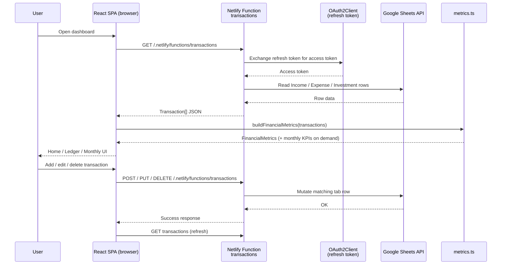

# Muffin

A personal finance Progressive Web App (**Muffin**) that turns a Google Sheet into a live dashboard. Track income, expenses, and investments in three familiar spreadsheet tabs; a Netlify-hosted React app connects to that workbook via the Google Sheets API, computes savings and net-worth metrics, and presents them in a warm, mobile-first UI you can install on your phone — and edit right from the app.

Think of it as baking your money muffins: sheet data goes in, and Home serves up KPIs, charts, and a ledger you can manage on the go.

---

## Table of Contents

- [1. What This App Does (Functional Description)](#1-what-this-app-does-functional-description)
  - [1.1 Purpose and audience](#11-purpose-and-audience)
  - [1.2 Data model](#12-data-model)
  - [1.3 How investments are treated](#13-how-investments-are-treated)
  - [1.3.1 Provident Fund (display-only)](#131-provident-fund-display-only)
  - [1.4 Metrics the dashboard computes](#14-metrics-the-dashboard-computes)
  - [1.5 Views and features](#15-views-and-features)
  - [1.6 Everyday data flow](#16-everyday-data-flow)
  - [1.7 Where data lives](#17-where-data-lives)
  - [1.8 Limitations](#18-limitations)
- [2. Setup Tutorial (Non-Developer Friendly)](#2-setup-tutorial-non-developer-friendly)
  - [2.1 Prerequisites](#21-prerequisites)
  - [2.2 Create your Google Sheet workbook](#22-create-your-google-sheet-workbook-single-book-three-tabs)
  - [2.3 Create a Google Cloud project and OAuth credentials](#23-create-a-google-cloud-project-and-oauth-credentials)
  - [2.4 Add OAuth redirect URIs](#24-add-oauth-redirect-uris)
  - [2.5 Get the project onto GitHub](#25-get-the-project-onto-github)
  - [2.6 Deploy on Netlify](#26-deploy-on-netlify)
  - [2.7 Configure environment variables](#27-configure-environment-variables-in-netlify)
  - [2.8 Optional: run locally](#28-optional-run-locally)
  - [2.9 Recipe and starting balances](#29-recipe-and-starting-balances)
  - [2.10 Everyday usage](#210-everyday-usage)
  - [2.11 Troubleshooting](#211-troubleshooting)
- [3. Technical Solution (For Developers)](#3-technical-solution-for-developers)
  - [3.1 Tech stack](#31-tech-stack)
  - [3.2 Repository architecture](#32-repository-architecture)
  - [3.3 Runtime architecture and data flow](#33-runtime-architecture-and-data-flow)
  - [3.4 Domain model and API](#34-domain-model-and-api)
  - [3.5 Metrics engine](#35-metrics-engine)
  - [3.6 Frontend application structure](#36-frontend-application-structure)
  - [3.7 PWA behavior](#37-pwa-behavior)
  - [3.8 Deployment and environments](#38-deployment-and-environments)
  - [3.9 Security and privacy](#39-security-and-privacy)
  - [3.10 Extensibility](#310-extensibility)
  - [3.11 AI-assisted development](#311-ai-assisted-development)
  - [3.12 Product showcase PPT](#312-product-showcase-ppt)
- [4. Analysis & Developer Notes](#4-analysis--developer-notes)
- [5. Credits](#5-credits)

---

## 1. What This App Does (Functional Description)

### 1.1 Purpose and audience

This project is a **personal finance dashboard** for individuals who already (or prefer to) track money in Google Sheets. Instead of building formulas and charts inside the spreadsheet alone, you keep a simple ledger in Sheets and open a phone-friendly web app that shows:

- This month's income, spending, and investments
- Liquid cash vs invested savings
- Net worth and growth since you started tracking
- Investment breakup (top types on Home; full pie on tap)
- Provident Fund totals on their own More Details card (not in net worth or investment breakup)
- Month-by-month trends and category breakdowns
- A planner for "what if I spend/save this?" scenarios without editing the real sheet
- In-app add / edit / delete for sheet transactions, written straight back to your Google Sheet

It is designed for **personal finance** (INR by default): each person signs in with Google and links **their own** spreadsheet. It is not a shared multi-bookkeeper suite or a bank aggregator.

### 1.2 Data model

Every money movement is a **transaction** with:

| Field | Meaning |
| --- | --- |
| **Date** | When it happened (`YYYY-MM-DD` preferred; `DD/MM/YYYY` also accepted) |
| **Category** | Label such as Salary, Rent, Groceries, Mutual Fund SIP |
| **Amount** | Number only — no `₹` or commas in the cell (e.g. `15000`) |
| **Comment** | Optional note (shown in lists) |
| **Investment Type** | Investment tab only: label such as Mutual Fund, Fixed Deposit, or Provident Fund (breakup uses non-PF types; PF labels detect the dedicated card) |

Transaction *type* (`Income` / `Expense` / `Investment`) is not a column you fill in — it's determined by **which tab the row lives on**. The app reads a single Google Sheets workbook with three fixed tabs: `Income`, `Expense`, and `Investment`.

Sample layouts for each tab live in:

- `templates/income_sheet_template.csv`
- `templates/expense_sheet_template.csv`
- `templates/investment_sheet_template.csv`
- `finance_template.csv` — a single-sheet reference showing all columns side by side (for eyeballing the layout only; see note in Section 2.2)

### 1.3 How investments are treated

Rows on the **Investment** tab (SIPs, stocks, FDs, etc.) are **money set aside**, not spent.

For any period:

- **Spends** = sum of Expense rows
- **Investment (saved)** = sum of counted Investment rows (excludes Provident Fund — see below)
- **Liquid savings** = Income − Spends − Investment

So putting ₹10,000 into a SIP reduces liquid cash but increases your investment balance — it does **not** count as an expense.

### 1.3.1 Provident Fund (display-only)

You can log PF contributions as normal rows on the **Investment** tab. Tag them with **Investment Type** (or Category, as a fallback) set to one of:

- `Provident Fund`, `PF`, `EPF`, or `PPF` (case-insensitive; "provident fund" as a phrase also matches)

Those rows still appear in the Ledger, but they are **excluded** from:

- Net worth, liquid balance, and investment totals
- Investment Breakup card and pie chart
- Current-month investment / savings % math
- Planner investment totals

The **only** place PF surfaces on Home is its own **Provident Fund** card under **More Details** (cumulative total; tap for the PF entry list).

### 1.4 Metrics the dashboard computes

From your sheet rows plus optional starting balances (Recipe settings in the app, defaults in `src/config.ts`), the app derives:

- **Current month:** income, expense, investment, liquid change, savings %
- **Totals:** liquid balance, investment balance, net worth
- **Investment Breakup:** counted investment types only (PF omitted) — Home card shows the **top 3**; tap for the full pie
- **Provident Fund:** cumulative contributions (More Details only; not in net worth or breakup)
- **Lifetime:** total income, total spends, income − spends
- **Growth:** rupees and % since configured starting balances
- **Averages:** average monthly savings, months tracked
- **Monthly KPIs:** per-month income / spends / investment / liquid / closing liquid / savings percentages / expense-by-category

Currency display defaults to **₹** with Indian digit grouping (e.g. ₹1,50,000).

### 1.5 Views and features

| Tab | What it does |
| --- | --- |
| **Home** | KPI cards; tap for charts or transaction lists. Investment Breakup shows top 3 chips; PF lives under More Details |
| **Planner** | Add temporary income/expense/investment lines (browser-only) and see this month's plan vs sheet data |
| **Ledger** | Searchable chronological list; add / edit / delete sheet-backed rows via the manage modal |
| **Monthly** | Month-by-month KPI breakdown |

Also included:

- **Independent Developer Identity** — Muffin is an independently developed personal software project created by Rahul Gouri, NOT an enterprise organization or business entity.
- **Legal Compliance & Privacy** — Public [Privacy Policy](public/privacy.html) (`/privacy`) and [Terms of Service](public/terms.html) (`/terms`) adhering to official [Google API Services User Data Policy](https://developers.google.com/terms/api-services-user-data-policy) Limited Use requirements. Contact support: `rahulgouri072@gmail.com`.
- **Interactive Touch Charts** — Tappable Donut/Pie slices with stroke expansion & glow, crosshair guidelines on trend graphs, pulsing active aura rings, and Month-over-Month (MoM) delta calculation cards.
- **Date-Grouped Fintech Timeline Ledger** — Grouped timeline headers ("Today", "Yesterday", "Mon, 10 Aug 2026") with daily totals, category-colored icon badges (`ArrowUpRight`, `Utensils`, `Coffee`, `ShoppingBag`, `Zap`), unclipped `createPortal` Action Sheet menu, and View Transaction Details modal.
- **1-Tap Dynamic Category Chips & Calculator Math** — Auto-extracted top 8 frequent category chips, decimal input mode for phone keypads, micro-haptics (`navigator.vibrate(8)`), and safe math expression evaluator supporting BODMAS arithmetic and `%` percentage calculations (e.g. `1000 * 18%` → `180` for tax/GST).
- **6 Premium Visual Upgrades** — Ambient FinTech radial aura glows on KPI cards, Shimmer Skeleton Card Loaders (`ShimmerSkeleton.tsx`), pastel category chip pills, ambient motion mesh gradient background blobs, 135° card background gradients (`cozy-card`) unified across all tabs (Home, Ledger, Monthly, Planner), and tactile card press physics.
- **32-Bit RGBA Transparent PNG Icons** — App icons (`icon_192.png` and `icon_512.png`) with 100% alpha transparency for phone home screens and dark mode.
- **Six muffin themes** — 3 light (Classic, Blueberry, Pistachio Matcha) and 3 dark (Double Chocolate, Red Velvet, Salted Caramel), with CSS design tokens + themed chart palettes.
- **Google Sign-In (multi-user)** — Each Google account gets its own session, linked spreadsheet, and Recipe; no shared Playground refresh token.
- **Header settings (gear)** — One menu for Mask, Theme, About, Privacy Policy, Terms of Service, Recipe (configuration), Download App (PWA install), and Log out.
- **Recipe** — View/copy linked spreadsheet ID; set initial opening balance and multiple initial investments by type (synced in Netlify Blobs for the signed-in user; local cache for snappy UI).
- **First-run tour** — Short guided intro (how the app works, main features, Recipe) shown once for new users after they link a sheet; Skip / Got it persists so returning users never see it again.

### 1.6 Everyday data flow

1. You sign in with Google in the app, then link an existing workbook (paste URL/ID) or create a new one.
2. New users get a short **tour** covering the dashboard, main tabs, and Recipe; completing or skipping it is stored on your account.
3. You add, edit, or delete rows via the in-app Ledger / **+** button, or directly in Google Sheets.
4. A **Netlify Function** uses your signed-in Google session (refresh token in an httpOnly cookie) and your linked spreadsheet ID (stored in Netlify Blobs per Google user) to read/write the `Income`, `Expense`, and `Investment` tabs. App OAuth client secrets never ship to the browser.
5. The React app fetches transactions from that function on load (and after every add/edit/delete), builds metrics client-side, and updates Home / Ledger / Monthly.
6. Planner entries stay on-device and never write back to Sheets. Recipe starting balances sync via Blobs so they follow you across devices.

### 1.7 Where data lives

| Data | Location |
| --- | --- |
| Real transactions | Your Google Sheet (`Income`, `Expense`, `Investment` tabs) |
| Google OAuth app credentials | Netlify / local env (`GOOGLE_CLIENT_ID`, `GOOGLE_CLIENT_SECRET`, `GOOGLE_REDIRECT_URI`, `SESSION_SECRET`) |
| Per-user sheet link + Recipe + tour flag | Netlify Blobs (`muffin-users`, keyed by Google user id) |
| Signed-in session | httpOnly cookie (encrypted refresh token) |
| Recipe local cache | Browser `localStorage` (`muffinRecipe`) — hydrated from Blobs on sign-in |
| Legal pages & redirects | Static `public/privacy.html`, `public/terms.html`, and `public/_redirects` |
| Developer support contact | `rahulgouri072@gmail.com` |
| Currency display | `src/config.ts` (`CURRENCY`) |
| Planner "what if" rows | Browser `localStorage` (`plannerTransactions`) |
| Selected muffin theme | Browser `localStorage` (`muffinTheme`) |
| Amount mask preference | Browser `localStorage` (`valuesMasked`) |
| App UI / assets | Netlify CDN (`dist` after build); live site: [muffin-ledger.netlify.app](https://muffin-ledger.netlify.app/) |

### 1.8 Limitations

- Muffin is an independently developed software project created by Rahul Gouri; Google OAuth verification is completed/pending for public production use.
- Not a bank aggregator — you enter transactions yourself (sheet or in-app forms).
- Read and write always travel together for the signed-in Google account.
- The three tabs (`Income`, `Expense`, `Investment`) are fixed by the server; a single combined tab with a `Type` column is not read by the current backend.
- The Planner does not sync across devices or back into Sheets.
- Recipe starting balances sync across devices via Blobs; theme / mask / planner stay browser-local.
- Provident Fund rows are tracked for display but do not change net worth / liquid / investment totals.
- If the function cannot reach the sheet (revoked access, sheet renamed, missing tabs), the UI shows a soft warning and falls back to configured starting balances.

---

## 2. Setup Tutorial (Non-Developer Friendly)

This section walks you from a blank Google Sheet to a live website. You do **not** need to be a programmer, but you will create a small Google Cloud project to authorize the app — follow the steps in order and it's mostly clicking through screens.

### 2.1 Prerequisites

Create free accounts for:

1. **Google** — for Google Sheets and Google Cloud (OAuth credentials)
2. **GitHub** — to hold a copy of this project (recommended)
3. **Netlify** — to host the website ([https://app.netlify.com](https://app.netlify.com); you can sign up with GitHub)

Also useful:

- A modern browser (Chrome, Edge, Firefox, or Safari)
- About 45–60 minutes the first time (the OAuth step takes the longest)

**Plain-English terms:**

- **Repository (repo)** — a project folder on GitHub
- **Fork** — your own copy of someone else's repo on GitHub
- **Deploy** — publishing the site so it has a public URL
- **Environment variable** — a private setting stored on Netlify (used for your Google credentials)
- **OAuth client** — a Google-issued ID/secret pair that identifies this app when it asks for permission to read your sheet
- **Refresh token** — a long-lived credential that lets the server fetch your data without you signing in every time

### 2.2 Create your Google Sheet workbook (single book, three tabs)

The app expects **one Google Spreadsheet (workbook)** with **exactly three tabs**, named precisely `Income`, `Expense`, and `Investment`.

#### Step A — Create the workbook

1. Go to [https://sheets.google.com](https://sheets.google.com) and sign in.
2. Click **Blank spreadsheet**.
3. Rename the file (top left), e.g. `My Personal Finances`.

#### Step B — Create three tabs

At the bottom of the sheet:

1. Rename the first tab to `Income`.
2. Click **+** to add a second tab; name it `Expense`.
3. Click **+** again; name it `Investment`.

Tab names are matched exactly, so avoid trailing spaces or extra tabs with the same names. (You can delete any unused default tab.)

#### Step C — Add headers and sample rows

**Income tab** — row 1 headers, then data:

```text
Date,Category,Amount,Comment
2026-01-05,Salary,55000,Monthly salary credit
2026-01-18,Freelance,8000,Logo design project
```

**Expense tab:**

```text
Date,Category,Amount,Comment
2026-01-10,Groceries,4200,
2026-01-12,Rent,15000,
2026-01-22,Utilities,2200,Electricity + water
```

**Investment tab** (note the extra **Investment Type** column):

```text
Date,Category,Amount,Investment Type,Comment
2026-01-08,Mutual Fund SIP,10000,Mutual Fund,Index fund SIP
2026-02-09,Stocks,5000,Equities,Bought blue-chip shares
```

You can also copy from the repo files under `templates/` (`income_sheet_template.csv`, etc.): in Sheets use **File → Import → Upload**, importing each CSV into its matching tab.

> **Note:** `finance_template.csv` in the repo root shows all columns combined into one sheet — it's kept as a quick reference for the overall layout, but the live app always reads the three separate tabs described above, not a single combined tab.

#### Column rules (important)

- **Date:** prefer `YYYY-MM-DD` (e.g. `2026-01-05`). `DD/MM/YYYY` also works.
- **Amount:** digits only — `55000` not `₹55,000` (commas are stripped automatically, but keep it simple).
- **Do not leave the header row out** — the app skips the first row as headers.
- Replace sample rows with your real data anytime; the app reads live from the sheet on every load.

### 2.3 Create a Google Cloud project and OAuth credentials

Each end user signs in with **their own** Google account. The app uses a shared OAuth **Web client** (Client ID/Secret) to complete that sign-in and access Sheets on their behalf.

1. Go to [https://console.cloud.google.com](https://console.cloud.google.com) and sign in.
2. Create a new project (top bar → **New Project**), e.g. `Muffin Finance`.
3. Open **APIs & Services → Library**, search for **Google Sheets API**, and click **Enable**.
4. Open **APIs & Services → OAuth consent screen**:
   - Choose **External** and fill in the required app name / support email fields.
   - Scopes used by the app: `openid`, `email`, `profile`, and `https://www.googleapis.com/auth/spreadsheets`.
   - While status is **Testing**, add every Google account that should sign in as a **test user**.
5. Open **APIs & Services → Credentials → Create Credentials → OAuth client ID**:
   - Application type: **Web application**.
   - Save the generated **Client ID** and **Client Secret** somewhere private — you'll need them for Netlify / `.env`.

### 2.4 Add OAuth redirect URIs

On the same OAuth Web client, under **Authorized redirect URIs**, add:

- Local Netlify Dev: `http://localhost:8888/.netlify/functions/auth-callback`
- Production: `https://YOUR-SITE.netlify.app/.netlify/functions/auth-callback`

These must match `GOOGLE_REDIRECT_URI` exactly (including `http` vs `https`).

Users no longer generate a long-lived Playground refresh token. Sign-in in the app issues a per-user refresh token stored in an encrypted httpOnly session cookie; the linked spreadsheet ID is stored in Netlify Blobs keyed by Google user id.

### 2.5 Get the project onto GitHub

Recommended path: keep the code on GitHub so Netlify can rebuild automatically when you update.

#### Option A — Fork (if this repo is on GitHub)

1. Open the GitHub page for this project while signed in.
2. Click **Fork** (top right).
3. Confirm to create a copy under your account.

#### Option B — Create a new repo and upload

1. On GitHub, click **New repository**.
2. Name it (e.g. `muffin`), leave it Private if you prefer, create it.
3. Upload the project files (or use GitHub Desktop / `git` if you know how).
   - Include everything except secrets. Never upload a `.env` file or anything containing your Client Secret / Refresh Token — `.gitignore` already excludes `.env*` (except `.env.example`).

You do **not** need to understand the code to deploy. Netlify will build it for you.

### 2.6 Deploy on Netlify

1. Go to [https://app.netlify.com](https://app.netlify.com) and log in (GitHub login is easiest).
2. Click **Add new site → Import an existing project**.
3. Choose **GitHub** and authorize Netlify if prompted.
4. Select your fork / repo.
5. Confirm build settings (this repo already includes `netlify.toml`, which sets them):
   - **Build command:** `npm run build`
   - **Publish directory:** `dist`
   - Functions folder: `netlify/functions`
6. Click **Deploy site**.

Wait until the deploy finishes (a few minutes the first time). This project's production site is [https://muffin-ledger.netlify.app/](https://muffin-ledger.netlify.app/). Forks get a URL like `https://random-name.netlify.app`.

You can rename the site under **Site configuration → Domain management**.

> **Note:** Older versions of this project were a drag-and-drop static site. The current app is a **Vite + React** build. Prefer the Git-connected deploy above so Netlify runs `npm run build` and publishes `dist`.

### 2.7 Configure environment variables in Netlify

Until you add the OAuth app credentials, users cannot sign in or sync sheets.

1. In Netlify, open your site.
2. Turn **off** Private Access / password protection so the site is public (Google Sign-In gates data).
3. Go to **Site configuration → Environment variables**.
4. Add the following variables (all required):

| Variable name | Value |
| --- | --- |
| `GOOGLE_CLIENT_ID` | OAuth Client ID from Section 2.3 |
| `GOOGLE_CLIENT_SECRET` | OAuth Client Secret from Section 2.3 |
| `GOOGLE_REDIRECT_URI` | `https://YOUR-SITE.netlify.app/.netlify/functions/auth-callback` (must match the OAuth client redirect URI) |
| `SESSION_SECRET` | Long random string (e.g. `openssl rand -hex 32`) |

5. Remove legacy single-user vars if present: `GOOGLE_SPREADSHEET_ID`, `GOOGLE_REFRESH_TOKEN`.
6. Save the variables and **trigger a new deploy** (env changes do not apply until redeploy).
7. Open the live site → **Sign in with Google** → paste an existing sheet URL/ID or **Create a sheet for me**.

While the OAuth consent screen is in **Testing**, add each Google account as a test user.

**Local vs production redirect:** keep `GOOGLE_REDIRECT_URI=http://localhost:8888/.netlify/functions/auth-callback` in your local `.env` for `npm run dev`. Use your live site’s `https://YOUR-SITE.netlify.app/.netlify/functions/auth-callback` value only in Netlify Production (and matching Google OAuth redirect URIs).

### 2.8 Optional: run locally

If you want to try changes on your computer:

1. Install [Node.js](https://nodejs.org/) (LTS version).
2. Download or clone the repo to a folder.
3. Copy `.env.example` to `.env` and fill in `GOOGLE_CLIENT_ID`, `GOOGLE_CLIENT_SECRET`, `SESSION_SECRET`, and set `GOOGLE_REDIRECT_URI` to `http://localhost:8888/.netlify/functions/auth-callback`. Do **not** commit `.env`.
4. Add that same localhost redirect URI on your Google OAuth client.
5. Open a terminal in that folder and run:

```bash
npm install
npm run dev
```

6. `npm run dev` runs **Netlify Dev** (see `package.json`), which starts Vite and the serverless functions together. Open the URL it prints (often `http://localhost:8888`).
7. Netlify Dev picks up variables from your local `.env` file automatically.

### 2.9 Recipe and starting balances

You do **not** need a redeploy to set starting balances. In the live app (while signed in):

1. Open the header **gear** menu → **Recipe**.
2. View / copy the linked spreadsheet ID.
3. Set **Initial opening balance** (liquid cash before sheet history).
4. Add one or more **Initial investments** (type + amount), e.g. Fixed Deposits, Mutual Funds.
5. Save — values are written to **Netlify Blobs** for your Google account (and cached locally as `muffinRecipe` for the UI). They feed net worth / investment breakup on every device you sign into.

If you had Recipe values only in the browser before Blobs sync shipped, the first successful sign-in migrates a non-empty local Recipe to Blobs automatically.

Optional code defaults (used when no Recipe exists yet) and currency live in `src/config.ts` (`INITIAL_*`, `CURRENCY`). Changing currency still requires a rebuild/redeploy.

### 2.10 Everyday usage

1. Add, edit, or delete rows using the in-app **+** / Ledger edit flows — these write straight to your Google Sheet through the Netlify Function. You can also edit the sheet directly in Google Sheets.
2. Open your Netlify site (or pull to refresh) to see the latest numbers; the app re-fetches after every in-app add/edit/delete automatically.
3. On Home, tap KPI cards to open charts or filtered lists; open **More Details** for Provident Fund and extra KPIs.
4. Use **Planner** for temporary what-if entries (device-only).
5. Open the header **gear** for Mask, Theme, About, Recipe, Download App, and Log out.
6. After your first sheet link, walk through the **tour** (or skip it) — it will not appear again once completed.
7. On your phone browser, use **Download App** from the gear menu (or the browser’s Add to Home Screen / Install).

### 2.11 Troubleshooting

| Symptom | Likely fix |
| --- | --- |
| Warning that the sheet couldn't load | Check all four required env vars (`GOOGLE_CLIENT_ID`, `GOOGLE_CLIENT_SECRET`, `GOOGLE_REDIRECT_URI`, `SESSION_SECRET`); confirm the signed-in Google account still has access to the spreadsheet |
| Sign-in redirect / OAuth error | Redirect URI in Google Cloud, Netlify `GOOGLE_REDIRECT_URI`, and the live site URL must match exactly (prod: `https://YOUR-SITE.netlify.app/.netlify/functions/auth-callback`; local: `http://localhost:8888/.netlify/functions/auth-callback`) |
| Numbers stuck at starting balances only | Env vars missing, deploy not triggered after adding them, or sheet not linked yet — also check Recipe opening balance / investments (gear → Recipe) |
| Recipe missing on another device | Sign in with the same Google account; Recipe syncs via Blobs after Save |
| First-run tour keeps appearing | Complete or skip the tour (writes `tourCompletedAt` on your Blobs user record); returning accounts with an older linked sheet are auto-skipped |
| "Sheet tab X was not found" error | Confirm tabs are named exactly `Income`, `Expense`, `Investment` (case-sensitive, no extra spaces) |
| Some months missing | Dates invalid or Amount cells not plain numbers |
| Investments missing from breakup | Fill in **Investment Type** on the Investment tab (falls back to Category if blank) |
| PF showing in net worth / liquid | Tag PF with Investment Type `Provident Fund`, `PF`, `EPF`, or `PPF` so it is excluded from those totals |
| Add/edit/delete fails in the app | Re-sign in if the session expired; confirm the Google account has **edit** (not just view) access to the sheet |
| Site shows old UI after code change | Wait for Netlify deploy to finish; hard-refresh the browser (PWA may need a second load for the service worker) |
| Local `npm run dev` can't reach the function | Use `npm run dev` (Netlify Dev), not plain Vite alone, so `/.netlify/functions/*` exists; confirm `.env` is populated with the **localhost** redirect URI |

---

## 3. Technical Solution (For Developers)

### 3.1 Tech stack

| Layer | Technology | Role |
| --- | --- | --- |
| UI | **React 19** + **TypeScript** | Component tree, state, typed domain model |
| Motion | **Framer Motion** | Springs, layout tab pill, page/sheet enter-exit, modal portals |
| Icons | **Lucide React** | Soft-contoured header / nav / modal icons |
| Typography | **Syne** (display) + **DM Sans** (UI) | Branded header + app body font (Google Fonts) |
| Build | **Vite 6** + `@vitejs/plugin-react` | Dev server, production bundle |
| Styling | **Tailwind CSS 3** + CSS design tokens | Six muffin themes via `data-theme` (`canvas`, `surface`, `primary`, `border`, chart colors, …) |
| Forms | **react-select** (Creatable) | Investment Type combobox (existing types + free text) |
| PWA | **vite-plugin-pwa** + **Workbox** | Web app manifest, service worker, installability |
| Hosting | **Netlify** | CDN for `dist`, SPA redirects, CI from Git |
| Backend (thin) | **Netlify Functions** (`transactions`) | Server-side Google Sheets OAuth read/write; keeps credentials off the client |
| Sheets client | **google-spreadsheet** + **google-auth-library** | Typed wrapper over the Sheets API using an `OAuth2Client` with a stored refresh token |
| Data source | **Google Sheets** | Human-editable ledger / "database" (three tabs: Income, Expense, Investment) |
| Source control | **GitHub** | Repo hosting; Netlify build trigger on push |
| Tooling | **npm**, **Node.js**, **TypeScript ~5.7** | Install, typecheck (`tsc -b`), scripts |
| Showcase (dev) | **Playwright** + **pptxgenjs** | Galaxy A55 screenshots + `Muffin_Showcase.pptx` generator |
| AI IDE | **Cursor** | Agent/IDE-assisted implementation and docs |
| AI assist | **GitHub Copilot** | Inline pair-programming during development |

Runtime UI deps stay lean (`react`, `react-dom`, `react-select`, `framer-motion`, `lucide-react`). Charts/modals and metrics are custom code in `src/`. Server-side runtime dependencies include `google-auth-library`, `google-spreadsheet`, and `@netlify/blobs`. Playwright / pptxgenjs are **dev-only** showcase tooling (not shipped to production).

### 3.2 Repository architecture

```text
MuffinPWA/
├── src/
│   ├── main.tsx              # React entry + Theme / Mask / Recipe providers; FOUC theme bootstrap
│   ├── App.tsx                # Shell: auth, sheet load, tour, tabs, planner, gear menu, modals
│   ├── config.ts              # Currency helpers + Recipe defaults / local cache helpers
│   ├── types.ts                # Shared TypeScript types
│   ├── index.css               # Tailwind + 6 muffin theme tokens (`data-theme`)
│   ├── components/             # Home, Planner, Ledger, Monthly, HeaderMenu, RecipeModal, TourModal, charts, nav
│   ├── hooks/                  # Theme, Mask, RecipeConfig, PwaInstall
│   └── lib/
│       ├── api.ts               # Client → Netlify auth / sheet / recipe / tour / transactions
│       ├── themes.ts            # Theme catalog, persistence helpers, chart palettes
│       ├── motion.ts            # Shared Framer Motion springs / variants
│       ├── parseSheet.ts        # Date parsing + ID helpers (used by Planner)
│       ├── metrics.ts            # Aggregations and KPI builders
│       └── providentFund.ts      # PF detection helpers
├── scripts/
│   ├── capture-showcase.mjs     # Playwright Galaxy A55 screenshots (amounts masked)
│   └── build-showcase-ppt.mjs   # Builds docs/showcase/Muffin_Showcase.pptx
├── docs/showcase/
│   ├── Muffin_Showcase.pptx     # Product showcase deck
│   └── screens/                 # Captured PNGs (gitignored; regenerate via npm run showcase)
├── public/icons/                # PWA icons
├── netlify/functions/           # auth-*, sheet-*, recipe, tour-complete, transactions, health
├── netlify/lib/                 # Shared helpers (env, session, Blobs user store, Sheets, recipe/tour)
├── templates/                   # Per-tab CSV examples (Income / Expense / Investment)
├── finance_template.csv         # Reference-only combined layout (not read by the app)
├── legacy/                      # Previous vanilla JS PWA (CSV-publish based, reference)
├── dist/                        # Build output (generated)
├── netlify.toml                 # Build, publish, redirects, functions, secrets-scan omit
├── vite.config.ts               # React + PWA + dev proxy
├── tailwind.config.js           # Theme token colors, radii, warm shadows
├── index.html                   # Shell + Google Fonts + theme-color + inline theme bootstrap
├── .env.example                 # GOOGLE_* / SESSION_SECRET names for local + prod redirect notes
├── package.json
└── README.md
```

The project migrated from a vanilla `app.js` / `config.js` PWA that read published CSV links (`legacy/`) to a typed React SPA, then to **six muffin-inspired themes**, then from CSV-publish to **OAuth Google Sheets**, and most recently to **per-user Google Sign-In** with sheet ID + Recipe stored in **Netlify Blobs**.

### 3.3 Runtime architecture and data flow



**Why the proxy exists**

- Browser code only calls same-origin function paths.
- The OAuth Client ID/Secret stay in Netlify / local env; each user’s refresh token lives in an encrypted httpOnly session cookie — never in client bundles.
- Sheet ID, Recipe, and tour completion are stored in Netlify Blobs keyed by Google user id.
- Read and write share one transactions API surface (`src/lib/api.ts` → `transactions` function).

### 3.4 Domain model and API

Core types live in `src/types.ts`:

- `TransactionType`: `'income' | 'expense' | 'investment'`
- `SheetTabName`: `'Income' | 'Expense' | 'Investment'`
- `Transaction`: `id`, `date` (ISO `YYYY-MM-DD`), `category`, `type`, `amount`, `comment`, optional `investmentType`, optional `tabName` / `rowIndex` for sheet writes
- `FinancialMetrics` (includes `providentFundBalance`), `MonthlyKPI`, planner input types, KPI modal kinds (`MetricKey` includes `providentFund`)

**Client API** (`src/lib/api.ts`):

- Auth: `getMe`, `logout`, `AUTH_START_URL` → `auth-me` / `auth-logout` / `auth-start` (+ `auth-callback` for OAuth redirect)
- Sheet onboarding: `linkSheet`, `createSheet`, `unlinkSheet`
- Recipe: `getRecipe`, `saveRecipe` → `GET` / `PUT /.netlify/functions/recipe`
- Tour: `completeTour` → `POST /.netlify/functions/tour-complete`
- Transactions: `getTransactions`, `createTransaction` / `updateTransaction` / `deleteTransaction`

**Blobs user record** (`netlify/lib/userStore.js`, store `muffin-users`):

- `spreadsheetId` / `spreadsheetTitle` / `linkedAt`
- `recipe` — `{ openingBalance, investments[], updatedAt }`
- `tourCompletedAt` — set when the first-run tour is finished or skipped

**Sheets function** (`netlify/functions/transactions.js`):

- Authenticates with the signed-in user’s refresh token (`OAuth2Client`) and opens the workbook with `google-spreadsheet`'s `GoogleSpreadsheet`
- Reads all rows from the fixed `Income`, `Expense`, `Investment` tabs and maps them to typed `Transaction` objects (`GET`)
- Appends (`POST`), updates (`PUT`), or deletes (`DELETE`) a single row identified by tab name + row index
- Returns JSON with `Cache-Control: no-store`; errors carry a `statusCode` (e.g. 400 for a missing tab, 404 for a missing row, 401 when not signed in)

**PF helpers** (`src/lib/providentFund.ts`):

- `isProvidentFund` / `isCountedInvestment` / `sumProvidentFund` — used by metrics, planner, and chart lists

### 3.5 Metrics engine

`src/lib/metrics.ts` is pure (no I/O). Provident Fund helpers live in `src/lib/providentFund.ts`.

- `buildMonthlyKPIs` — groups by `YYYY-MM`, tracks expense categories, rolls **closing liquid** from `getOpeningBalance()` (Recipe); **excludes PF** from monthly investment
- `buildInvestmentBreakup` — seeds from Recipe initial investments (`getInitialInvestments()`) then adds **counted** investment rows by type/category (**excludes PF**; PF is only on its own card)
- `buildFinancialMetrics` — lifetime and current-month aggregates using **counted** investments only (PF excluded), plus `providentFundBalance` for the More Details card:

\[
\begin{aligned}
\text{investmentBalance} &= \text{initialInvestments} + \sum \text{countedInvestment} \\
\text{trackedLiquid} &= \sum \text{income} - \sum \text{expense} - \sum \text{countedInvestment} \\
\text{liquidBalance} &= \text{openingBalance} + \text{trackedLiquid} \\
\text{netWorth} &= \text{investmentBalance} + \text{liquidBalance} \\
\text{providentFundBalance} &= \sum \text{PF investment rows}
\end{aligned}
\]

Growth compares current net worth to `initialInvestments + openingBalance` (from Recipe / config defaults).

### 3.6 Frontend application structure

- **`App.tsx`** owns auth + sheet lifecycle, first-run tour, error banner, `metrics` (recomputed when sheet rows or Recipe config change), active tab, gear-menu modals (About / Recipe / manage transaction), planner CRUD with `localStorage` key `plannerTransactions`, and tab `AnimatePresence` transitions.
- **Views:** `HomeView` (KPI grid + `ChartModal` + More Details / PF), `PlannerView`, `LedgerView`, `MonthlyView`.
- **Shared UI:** `KpiCard`, `FloatingNav` (layout-animated active pill), `HeaderMenu` (gear dropdown + nested theme panel), `RecipeModal`, `TourModal`, `SoftButton`, `TransactionList`, `ChartModal` (list / pie / line; portaled sheet with enter/exit), `ManageTransactionModal`, `AboutModal`, `SignInScreen`, `SheetOnboarding`, `MuffinIcon`.
- **`KpiCard` tones:** semantic colors for income/expense/investment; Net Worth uses the theme **hero** primary gradient.
- **Themes:** `src/lib/themes.ts` catalogs six variants; `ThemeProvider` / `useTheme` apply `data-theme` + `dark` class, persist `muffinTheme`, and refresh `theme-color`. Charts pull per-theme `chartColors`.
- **Motion:** shared springs/variants in `src/lib/motion.ts` (Framer Motion).
- **Hooks:** `useTheme`, `useMask`, `useRecipeConfig` (local cache + `persistConfig` → Blobs), `usePwaInstall` (`beforeinstallprompt`).
- Layout is mobile-first (`max-w-lg`), branded sticky header with a single gear control, floating bottom nav width-matched to cards, themed modals/forms portaled above the nav.

### 3.7 PWA behavior

Configured in `vite.config.ts` via `VitePWA`:

- Manifest name/short name, portrait standalone display, theme colors, 192/512 icons (including maskable)
- `registerType: 'autoUpdate'`
- Workbox precaches static assets (`js/css/html/ico/png/svg/woff2`) with `navigateFallback: '/index.html'`
- Live finance data is fetched through the Netlify Function and should not be treated as durable offline truth; the shell can load offline, but KPIs need network for the function to reach Google Sheets

### 3.8 Deployment and environments

From `netlify.toml`:

```toml
[build]
  command = "npm run build"
  publish = "dist"
  functions = "netlify/functions"

# Redirect URIs are public during OAuth; omit from Netlify secret scan.
[build.environment]
  SECRETS_SCAN_OMIT_KEYS = "GOOGLE_REDIRECT_URI"

[[redirects]]
  from = "/*"
  to = "/index.html"
  status = 200
```

- **Build:** `tsc -b && vite build` (`package.json`)
- **Dev:** `npm run dev` → `netlify dev` running Vite on `5173`, Netlify on `8888`; Vite proxies `/.netlify/functions` to `8888`
- **CI path:** push to GitHub → Netlify builds → deploys `dist` + functions
- **Production site:** [https://muffin-ledger.netlify.app/](https://muffin-ledger.netlify.app/)
- **Env contract:** four required vars — see Section 2.7; never commit `.env` or secret credentials
- After changing Netlify env vars, **trigger a new deploy** so functions pick them up
- Do not put your real production redirect URL in committed docs (use `YOUR-SITE` placeholders) so secret scanning does not fail the build

### 3.9 Security and privacy

- Google OAuth Client ID/Secret live only in Netlify / local env and are used server-side by auth and Sheets functions; the browser never sees them.
- Each user’s Google refresh token is stored in an encrypted httpOnly session cookie (`SESSION_SECRET`); treat that secret like a password and rotate it if exposed.
- End users must **Sign in with Google**; sheet access is limited to the signed-in account’s linked workbook (ID in Netlify Blobs).
- Recipe starting balances and the first-run tour completion flag also live on the Blobs user record (cross-device). Planner data, theme, and mask preference remain local to one browser profile.
- Auth error redirects use short codes (not long Google messages) so the address bar stays clean; the SPA also strips leftover OAuth query params on load.
- Function responses use `Cache-Control: no-store` to reduce accidental CDN caching of financial payloads.
- `.gitignore` excludes `.env` and `.env.*` (except `.env.example`) so local credential files aren't committed by accident.

### 3.10 Extensibility

- **New KPI:** extend `FinancialMetrics` / `MetricKey`, compute in `metrics.ts`, add a card in `HomeView`, wire a modal kind in `ChartModal` if interactive.
- **New column:** update the Sheets row mapping in `netlify/functions/transactions.js` and the matching templates; keep header-row assumptions documented.
- **Different backend:** replace the transactions function with any API that returns the same shapes expected by `src/lib/api.ts`.
- **Multi-currency:** display helpers are centralized in `config.ts` / `useMask`, but amounts are stored as plain numbers with no FX conversion today.
- **PF-like carve-outs:** extend `providentFund.ts` matching rules if you need another display-only bucket.
- **Service account instead of OAuth:** the function could be adapted to use a Google service account JSON key (share the sheet with the service account's email) instead of a user refresh token, trading the one-time OAuth Playground step for key-file management.

### 3.11 AI-assisted development

This codebase was developed with AI-assisted tooling in the loop:

- **Cursor** — agent-driven refactors (vanilla PWA → React/Vite, CSV-publish → OAuth Sheets API), feature work, and documentation
- **GitHub Copilot** — inline completions while editing components and libs

These are **development aids**, not runtime dependencies. The production site only needs Node (build time), Netlify, and a browser.

### 3.12 Product showcase PPT

A masked, Galaxy A55–framed product deck lives at **`docs/showcase/Muffin_Showcase.pptx`** (12 slides: title, promise, Home, drill-downs, themes, Planner, Ledger, Monthly, privacy/polish, architecture, stack, credits).

Screenshots are captured from the **local running app** at CSS viewport **360×780** with **`deviceScaleFactor: 3`** (PNG size **1080×2340**), with amounts masked via the gear menu **Mask** control.

| Script | Purpose |
| --- | --- |
| `scripts/capture-showcase.mjs` | Playwright walkthrough → `docs/showcase/screens/*.png` |
| `scripts/build-showcase-ppt.mjs` | Embeds those PNGs into `Muffin_Showcase.pptx` via pptxgenjs |

**Regenerate (requires `npm run dev` / Netlify Dev on `:8888`):**

```bash
# First time only (if Chromium not installed yet)
npx playwright install chromium

# Capture + build deck
npm run showcase

# Or separately:
npm run showcase:capture
npm run showcase:ppt
```

Optional base URL override:

```bash
node scripts/capture-showcase.mjs http://localhost:8888
```

`docs/showcase/screens/` is gitignored (regenerate locally). The `.pptx` itself can be kept in the repo for sharing.

---

## 4. Analysis & Developer Notes

- **Quick dev commands:**
  - `npm install` — install dependencies
  - `npm run dev` — run Netlify Dev (Vite + functions)
  - `npm run build` — TypeScript build then Vite production build
  - `npm run preview` — preview the production build locally
  - `npm run showcase` — capture Galaxy A55 screenshots (masked) and rebuild `docs/showcase/Muffin_Showcase.pptx`
  - `npm run showcase:capture` / `npm run showcase:ppt` — run capture or PPT build alone

- **Project layout (key folders):**
  - `src/` — React + TypeScript app (`main.tsx`, `App.tsx`, views and components)
  - `src/config.ts` — currency helpers + Recipe defaults / local cache (`muffinRecipe`)
  - `netlify/functions/` — auth-*, sheet-*, `recipe`, `tour-complete`, transactions, health
  - `netlify/lib/` — shared env, session, Blobs user store (sheet + recipe + tour), Sheets bootstrap helpers
  - `scripts/` — showcase capture (`capture-showcase.mjs`) and PPT builder (`build-showcase-ppt.mjs`)
  - `docs/showcase/` — product showcase deck + regenerated screen PNGs
  - `public/` — static assets and icons
  - `templates/` — CSV templates for the three required sheet tabs
  - `legacy/` — older version of the app and service-worker (kept for reference)
  - `future-upgrades/` — notes and ideas for future changes

- **Build & runtime notes:**
  - The `build` script runs `tsc -b` (TypeScript project references) then `vite build`.
  - Netlify Functions require these environment variables: `GOOGLE_CLIENT_ID`, `GOOGLE_CLIENT_SECRET`, `GOOGLE_REDIRECT_URI`, `SESSION_SECRET`.
  - Production redirect: `https://YOUR-SITE.netlify.app/.netlify/functions/auth-callback`.
  - Local development uses `netlify dev` so the functions are available at `/.netlify/functions/*` while testing; local `.env` must use the localhost redirect URI.
  - Blobs stores per-user `{ spreadsheetId, recipe, tourCompletedAt, … }` under store `muffin-users`.
  - Showcase capture expects the app reachable (usually `http://localhost:8888`) with sheet data loading; amounts are masked in every shot.
  - There are no automated tests or linters configured in this repo currently.

- **Notable dependencies:** React 19, Vite, TypeScript, Netlify CLI, `@netlify/blobs`, `google-auth-library`, `google-spreadsheet`, `framer-motion`, `lucide-react`, `vite-plugin-pwa`; showcase tooling: `playwright`, `pptxgenjs`.

- **Maintenance suggestions:**
  - Add CI (build + basic lint/tests) and README badges for clarity.
  - Consider migrating serverless functions to TypeScript for type safety and DX.
  - Add a short `DEVELOPER.md` with recommended environment variables and a `.env.example` reference (there is already an `.env.example` present).

- **Where to look next:**
  - App entry: `src/main.tsx` and `src/App.tsx` for routing and bootstrapping.
  - Server functions: `netlify/functions/transactions.js` for read/write logic against Google Sheets.
  - Templates: `templates/` and `finance_template.csv` for sample sheet layouts.

## 5. Credits

- **Vibe Coded by Rahul Gouri, 2026** (also shown in-app via gear → **About**).
- Built as a cozy personal finance PWA using React, Vite, Tailwind (six muffin theme tokens), Framer Motion, Lucide, Syne/DM Sans, react-select, and Netlify Functions.
- Live site: [https://muffin-ledger.netlify.app/](https://muffin-ledger.netlify.app/).
- Product showcase deck: `docs/showcase/Muffin_Showcase.pptx` (regenerate with `npm run showcase`).
- Google Sheets used as a lightweight, human-editable data backend, accessed via the Google Sheets API over OAuth 2.0.
- Legacy vanilla implementation (CSV-publish based) retained under `legacy/` for reference.

If you publish your own fork, keep your `GOOGLE_CLIENT_SECRET` / `SESSION_SECRET` and other credentials private, and avoid committing personal financial CSVs with real data.
