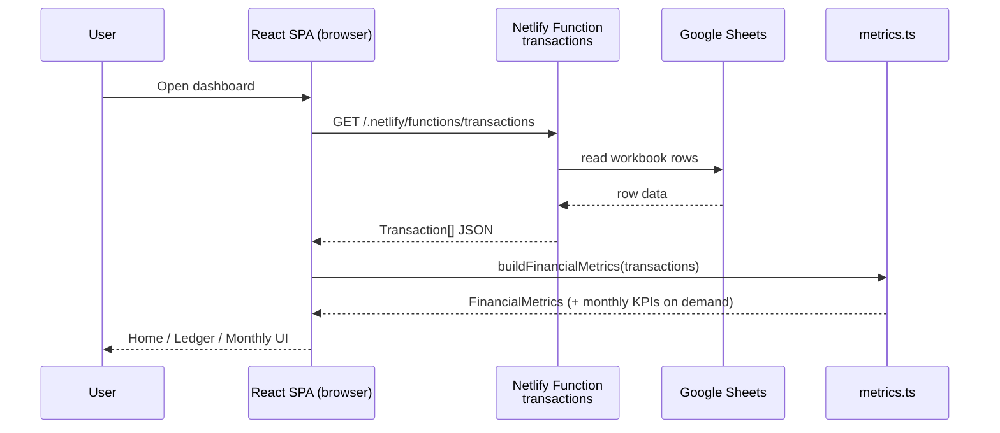

# Muffin

A personal finance Progressive Web App (**Muffin**) that turns a Google Sheet into a live dashboard. Track income, expenses, and investments in familiar spreadsheet tabs; a Netlify-hosted React app fetches that data securely, computes savings and net-worth metrics, and presents them in a warm, mobile-first UI you can install on your phone.

Think of it as baking your money muffins: sheet data goes in, and Home serves up KPIs, charts, and a ledger you can edit on the go.

---

## Table of Contents

- [1. What This App Does (Functional Description)](#1-what-this-app-does-functional-description)
  - [1.1 Purpose and audience](#11-purpose-and-audience)
  - [1.2 Data model](#12-data-model)
  - [1.3 How investments are treated](#13-how-investments-are-treated)
  - [1.3.1 Provident Fund (display-only)](#131-provident-fund-display-only)
  - [1.4 Metrics the dashboard computes](#14-metrics-the-dashboard-computes)
  - [1.5 Views and features](#15-views-and-features)
  - [1.6 Everyday data flow](#16-everyday-data-flow)
  - [1.7 Where data lives](#17-where-data-lives)
  - [1.8 Limitations](#18-limitations)
- [2. Setup Tutorial (Non-Developer Friendly)](#2-setup-tutorial-non-developer-friendly)
  - [2.1 Prerequisites](#21-prerequisites)
  - [2.2 Create your Google Sheet workbook](#22-create-your-google-sheet-workbook-single-book-multiple-sheets)
  - [2.3 Publish sheets to the web as CSV](#23-publish-sheets-to-the-web-as-csv)
  - [2.4 Get the project onto GitHub](#24-get-the-project-onto-github)
  - [2.5 Deploy on Netlify](#25-deploy-on-netlify)
  - [2.6 Configure environment variables](#26-configure-environment-variables-in-netlify)
  - [2.7 Optional: run locally](#27-optional-run-locally)
  - [2.8 Optional: customize starting balances](#28-optional-customize-starting-balances--currency)
  - [2.9 Everyday usage](#29-everyday-usage)
  - [2.10 Troubleshooting](#210-troubleshooting)
- [3. Technical Solution (For Developers)](#3-technical-solution-for-developers)
  - [3.1 Tech stack](#31-tech-stack)
  - [3.2 Repository architecture](#32-repository-architecture)
  - [3.3 Runtime architecture and data flow](#33-runtime-architecture-and-data-flow)
  - [3.4 Domain model and parsing](#34-domain-model-and-parsing)
  - [3.5 Metrics engine](#35-metrics-engine)
  - [3.6 Frontend application structure](#36-frontend-application-structure)
  - [3.7 PWA behavior](#37-pwa-behavior)
  - [3.8 Deployment and environments](#38-deployment-and-environments)
  - [3.9 Security and privacy](#39-security-and-privacy)
  - [3.10 Extensibility](#310-extensibility)
  - [3.11 AI-assisted development](#311-ai-assisted-development)
- [4. Credits](#4-credits)

---

## 1. What This App Does (Functional Description)

### 1.1 Purpose and audience

This project is a **personal finance dashboard** for individuals who already (or prefer to) track money in Google Sheets. Instead of building formulas and charts inside the spreadsheet alone, you keep a simple ledger in Sheets and open a phone-friendly web app that shows:

- This month’s income, spending, and investments
- Liquid cash vs invested savings
- Net worth and growth since you started tracking
- Investment breakup (top types on Home; full pie on tap)
- Provident Fund totals tracked separately (not mixed into net worth)
- Month-by-month trends and category breakdowns
- A planner for “what if I spend/save this?” scenarios without editing the real sheet
- In-app add / edit / delete for sheet transactions when write access is configured

It is designed for personal use (INR by default), not for multi-user accounting or bank sync.

### 1.2 Data model

Every money movement is a **transaction** with:

| Field | Meaning |
| --- | --- |
| **Date** | When it happened (`YYYY-MM-DD` preferred; `DD/MM/YYYY` also accepted) |
| **Category** | Label such as Salary, Rent, Groceries, Mutual Fund SIP |
| **Amount** | Number only — no `₹` or commas in the cell (e.g. `15000`) |
| **Type** | Exactly one of `Income`, `Expense`, or `Investment` (combined sheet) — or implied by which tab you use (separate sheets) |
| **Comment** | Optional note (shown in lists) |
| **Investment Type** | On the Investment tab: label such as Mutual Fund, Fixed Deposit, or Provident Fund (used for breakup + PF detection) |

Sample templates live in:

- `finance_template.csv` — one combined sheet with a `Type` column
- `templates/income_sheet_template.csv`
- `templates/expense_sheet_template.csv`
- `templates/investment_sheet_template.csv`

### 1.3 How investments are treated

Rows marked **Investment** (SIPs, stocks, FDs, etc.) are **money set aside**, not spent.

For any period:

- **Spends** = sum of Expense rows
- **Investment (saved)** = sum of counted Investment rows (excludes Provident Fund — see below)
- **Liquid savings** = Income − Spends − Investment

So putting ₹10,000 into a SIP reduces liquid cash but increases your investment balance — it does **not** count as an expense.

### 1.3.1 Provident Fund (display-only)

You can log PF contributions as normal **Investment** rows. Tag them with Investment Type (or Category) set to one of:

- `Provident Fund`, `PF`, `EPF`, or `PPF` (case-insensitive; “provident fund” as a phrase also matches)

Those rows still appear in the Ledger and in the **Investment Breakup** chart (so you can see every type), but they are **excluded** from:

- Net worth, liquid balance, and investment totals
- Current-month investment / savings % math
- Planner investment totals

A dedicated **Provident Fund** card under Home → **More Details** shows the cumulative PF total and opens a list of PF entries when tapped.

### 1.4 Metrics the dashboard computes

From your sheet rows plus optional starting balances in `src/config.ts`, the app derives:

- **Current month:** income, expense, investment, liquid change, savings %
- **Totals:** liquid balance, investment balance, net worth
- **Investment Breakup:** all investment types (including PF) — Home card shows the **top 3**; tap for the full pie
- **Provident Fund:** cumulative contributions (More Details; not in net worth)
- **Lifetime:** total income, total spends, income − spends
- **Growth:** rupees and % since configured starting balances
- **Averages:** average monthly savings, months tracked
- **Monthly KPIs:** per-month income / spends / investment / liquid / closing liquid / savings percentages / expense-by-category

Currency display defaults to **₹** with Indian digit grouping (e.g. ₹1,50,000).

### 1.5 Views and features

| Tab | What it does |
| --- | --- |
| **Home** | KPI cards; tap for charts or transaction lists. Investment Breakup shows top 3 chips; PF lives under More Details |
| **Planner** | Add temporary income/expense/investment lines (browser-only) and see this month’s plan vs sheet data |
| **Ledger** | Searchable chronological list; add / edit / delete sheet-backed rows via the manage modal |
| **Monthly** | Month-by-month KPI breakdown |

Also included:

- **Warm Muffin theme** — cream / oat light mode and dark chocolate / cocoa dark mode (CSS design tokens)
- **Dark / light theme** toggle (persisted); theme-color meta updates with the mode
- **Amount masking** (hide figures when someone is looking over your shoulder)
- **About** info button (header) — credits, product blurb, and stack
- **PWA install** — add to home screen on phone/desktop
- Compact branded sticky header (muffin icon + wordmark) + full-width floating bottom nav aligned with cards

### 1.6 Everyday data flow

1. You add or edit rows in Google Sheets **or** via the in-app Ledger / + button (writes back through a Netlify Function when configured).
2. Google’s published CSV (and/or the Sheets API write path) keeps the workbook as source of truth.
3. A **Netlify Function** reads/writes sheet data; secret credentials stay on the server.
4. The React app parses rows → builds metrics → updates Home / Ledger / Monthly.
5. Planner entries stay on-device and never write back to Sheets.

### 1.7 Where data lives

| Data | Location |
| --- | --- |
| Real transactions | Your Google Sheet |
| Published CSV links | Netlify environment variables (`SECRET_GOOGLE_SHEETS_*`) — never shipped to the browser |
| Starting balances / currency | `src/config.ts` (baked into the build when you change them) |
| Planner “what if” rows | Browser `localStorage` |
| App UI / assets | Netlify CDN (`dist` after build) |

### 1.8 Limitations

- No Google sign-in inside the app UI; sheet access is via published CSV and/or server-side Sheets credentials.
- Not a bank aggregator — you enter transactions yourself (sheet or in-app forms).
- “Publish to web” is privacy-by-obscure-link, not password login.
- The Planner does not sync across devices or back into Sheets.
- Provident Fund rows are tracked for display but do not change net worth / liquid / investment totals.
- If the function cannot load the sheet, the UI still shows overview numbers from configured starting balances and shows a soft warning.

---

## 2. Setup Tutorial (Non-Developer Friendly)

This section walks you from a blank Google Sheet to a live website. You do **not** need to be a programmer. Follow the steps in order.

### 2.1 Prerequisites

Create free accounts for:

1. **Google** — for Google Sheets
2. **GitHub** — to hold a copy of this project (recommended)
3. **Netlify** — to host the website ([https://app.netlify.com](https://app.netlify.com); you can sign up with GitHub)

Also useful:

- A modern browser (Chrome, Edge, Firefox, or Safari)
- About 30–45 minutes the first time

**Plain-English terms:**

- **Repository (repo)** — a project folder on GitHub
- **Fork** — your own copy of someone else’s repo on GitHub
- **Deploy** — publishing the site so it has a public URL
- **Environment variable** — a private setting stored on Netlify (used for your sheet links)

### 2.2 Create your Google Sheet workbook (single book, multiple sheets)

We recommend **one Google Spreadsheet (workbook)** with **three tabs**. The app is built to fetch Income, Expense, and Investment separately when you configure three URLs.

#### Step A — Create the workbook

1. Go to [https://sheets.google.com](https://sheets.google.com) and sign in.
2. Click **Blank spreadsheet**.
3. Rename the file (top left), e.g. `My Personal Finances`.

#### Step B — Create three tabs

At the bottom of the sheet:

1. Rename the first tab to `Income`.
2. Click **+** to add a second tab; name it `Expense`.
3. Click **+** again; name it `Investment`.

(You can delete any unused default tab.)

#### Step C — Add headers and sample rows

**Income tab** — row 1 headers, then data:

```text
Date,Category,Amount,Comment
2026-01-05,Salary,55000,Monthly salary credit
2026-01-18,Freelance,8000,Logo design project
```

**Expense tab:**

```text
Date,Category,Amount,Comment
2026-01-10,Groceries,4200,
2026-01-12,Rent,15000,
2026-01-22,Utilities,2200,Electricity + water
```

**Investment tab** (note the extra **Investment Type** column):

```text
Date,Category,Amount,Investment Type,Comment
2026-01-08,Mutual Fund SIP,10000,Mutual Fund,Index fund SIP
2026-02-09,Stocks,5000,Equities,Bought blue-chip shares
```

You can also copy from the repo files under `templates/` (`income_sheet_template.csv`, etc.): in Sheets use **File → Import → Upload**.

#### Column rules (important)

- **Date:** prefer `YYYY-MM-DD` (e.g. `2026-01-05`). `DD/MM/YYYY` also works.
- **Amount:** digits only — `55000` not `₹55,000`.
- **Do not leave the header row out** — the app skips the first row as headers.
- Replace sample rows with your real data anytime. The dashboard reads live published data after you refresh the site.

#### Alternative: one combined tab

If you prefer a single tab, use columns:

```text
Date,Category,Amount,Type,Comment
```

`Type` must be exactly `Income`, `Expense`, or `Investment` (any capitalization is fine; the parser lowercases it). See `finance_template.csv`. In that case you will configure **one** Netlify variable later (`SECRET_GOOGLE_SHEETS_URL`) instead of three.

### 2.3 Publish sheets to the web as CSV

Publishing creates a special link that returns your tab as a CSV file. The website’s server uses that link; visitors never see it.

#### For each tab (Income, Expense, Investment)

1. Open your workbook in Google Sheets.
2. Click **File → Share → Publish to web**.
3. In the dialog:
   - Under the link dropdown, choose the **specific tab** (e.g. `Income`).
   - Under the format dropdown, choose **Comma-separated values (.csv)**.
4. Click **Publish** and confirm if asked.
5. Copy the generated URL. It looks like:

   `https://docs.google.com/spreadsheets/d/e/......../pub?gid=........&single=true&output=csv`

6. Paste it into a notes app and label it (`Income URL`, `Expense URL`, `Investment URL`).
7. Repeat for the other two tabs. Each tab gets its **own** publish link (the `gid=` part differs).

#### Privacy note (read this)

“Publish to web” does **not** list your sheet in Google search as a normal public Drive share, but **anyone who has the exact long URL can open the CSV**. Treat those URLs like passwords:

- Do **not** paste them into the public README, Discord, or screenshots.
- Put them only in Netlify’s private environment variables (next steps).
- If a URL ever leaks, stop publishing that link in Sheets and publish again to get a new one, then update Netlify.

This is lighter-weight than building a login system, but it is **not** the same as password-protected access.

### 2.4 Get the project onto GitHub

Recommended path: keep the code on GitHub so Netlify can rebuild automatically when you update.

#### Option A — Fork (if this repo is on GitHub)

1. Open the GitHub page for this project while signed in.
2. Click **Fork** (top right).
3. Confirm to create a copy under your account.

#### Option B — Create a new repo and upload

1. On GitHub, click **New repository**.
2. Name it (e.g. `muffin`), leave it Private if you prefer, create it.
3. Upload the project files (or use GitHub Desktop / `git` if you know how).
   - Include everything except secrets. Never upload files containing your published sheet URLs.

You do **not** need to understand the code to deploy. Netlify will build it for you.

### 2.5 Deploy on Netlify

1. Go to [https://app.netlify.com](https://app.netlify.com) and log in (GitHub login is easiest).
2. Click **Add new site → Import an existing project**.
3. Choose **GitHub** and authorize Netlify if prompted.
4. Select your fork / repo.
5. Confirm build settings (this repo already includes `netlify.toml`, which sets them):
   - **Build command:** `npm run build`
   - **Publish directory:** `dist`
   - Functions folder: `netlify/functions`
6. Click **Deploy site**.

Wait until the deploy finishes (a few minutes the first time). Netlify gives you a URL like `https://random-name.netlify.app`.

You can later rename it under **Site configuration → Domain management**.

> **Note:** Older versions of this project were a drag-and-drop static site. The current app is a **Vite + React** build. Prefer the Git-connected deploy above so Netlify runs `npm run build` and publishes `dist`.

### 2.6 Configure environment variables in Netlify

Until you add the sheet URLs, the dashboard cannot load live transactions.

1. In Netlify, open your site.
2. Go to **Site configuration → Environment variables**.
3. Add variables depending on your sheet layout:

#### Multi-sheet setup (recommended — matches Section 2.2)

| Variable name | Value |
| --- | --- |
| `SECRET_GOOGLE_SHEETS_URL_INCOME` | Published CSV URL for the **Income** tab |
| `SECRET_GOOGLE_SHEETS_URL_EXPENSE` | Published CSV URL for the **Expense** tab |
| `SECRET_GOOGLE_SHEETS_URL_INVESTMENT` | Published CSV URL for the **Investment** tab |

All three must be set for separate-sheet mode. If all three exist, the server prefers them over a combined URL.

#### Combined single-tab setup

| Variable name | Value |
| --- | --- |
| `SECRET_GOOGLE_SHEETS_URL` | Published CSV URL for the combined tab |

4. Save the variables.
5. **Trigger a new deploy** (Deploys → Trigger deploy → Deploy site) so the function picks up the new values.
6. Open your live site. You should see KPIs fill in from your sample (or real) rows. Use a hard refresh if needed.

### 2.7 Optional: run locally

If you want to try changes on your computer:

1. Install [Node.js](https://nodejs.org/) (LTS version).
2. Download or clone the repo to a folder.
3. Open a terminal in that folder and run:

```bash
npm install
npm run dev
```

4. `npm run dev` runs **Netlify Dev** (see `package.json`), which starts Vite and the serverless function together. Open the URL it prints (often `http://localhost:8888`).
5. For local sheet loading, set the same `SECRET_GOOGLE_SHEETS_*` variables in a Netlify env file or your Netlify site’s env (Netlify Dev can pull site env vars when linked). Do not commit secret URLs to git.

### 2.8 Optional: customize starting balances / currency

Open `src/config.ts` and edit the numbers at the top, for example:

- `INITIAL_REGULAR_DEPOSITS`, `INITIAL_FIXED_DEPOSITS`, `INITIAL_MUTUAL_FUNDS` — investments you already held before the sheet history starts
- `INITIAL_LIQUID_BALANCE` — cash starting point
- `CURRENCY.symbol` / `CURRENCY.locale` — if you need a different currency display

After changing these, redeploy (or rebuild locally) so the new values are included.

### 2.9 Everyday usage

1. Add or edit rows in Google Sheets, or use the in-app **+** / Ledger edit flows.
2. Wait a short moment for Google’s published CSV to refresh when reading via publish links (sometimes near-instant, sometimes a minute).
3. Open your Netlify site and refresh if needed.
4. On Home, tap KPI cards to open charts or filtered lists; open **More Details** for Provident Fund and extra KPIs.
5. Use **Planner** for temporary what-if entries (device-only).
6. Use the eye icon to mask amounts; use the sun/moon icon for theme; tap the **i** icon for About / credits.
7. On your phone browser, use **Add to Home Screen** / **Install app** for the PWA.

### 2.10 Troubleshooting

| Symptom | Likely fix |
| --- | --- |
| Warning that the sheet couldn’t load | Check env var names/spelling; confirm publish links still work by opening them in a private browser window |
| Numbers stuck at starting balances only | Env vars missing or deploy not triggered after adding them |
| Some months missing | Dates invalid or Amount cells not plain numbers |
| Investments missing from breakup | On separate Investment sheet, fill **Investment Type**; on combined sheet, Category is used as the investment label |
| PF showing in net worth / liquid | Tag PF with Investment Type `Provident Fund`, `PF`, `EPF`, or `PPF` so it is excluded from those totals |
| Site shows old UI after code change | Wait for Netlify deploy to finish; hard-refresh the browser |
| Local `npm run dev` can’t reach the function | Use `npm run dev` (Netlify Dev), not plain Vite alone, so `/.netlify/functions/*` exists |

---

## 3. Technical Solution (For Developers)

### 3.1 Tech stack

| Layer | Technology | Role |
| --- | --- | --- |
| UI | **React 19** + **TypeScript** | Component tree, state, typed domain model |
| Typography | **Syne** (display) + **DM Sans** (UI) | Branded header + app body font (Google Fonts) |
| Build | **Vite 6** + `@vitejs/plugin-react` | Dev server, production bundle |
| Styling | **Tailwind CSS 3** + CSS design tokens | Warm Muffin light/dark palette (`canvas`, `surface`, `primary`, `border`, …) |
| Forms | **react-select** (Creatable) | Investment Type combobox (existing types + free text) |
| PWA | **vite-plugin-pwa** + **Workbox** | Web app manifest, service worker, installability |
| Hosting | **Netlify** | CDN for `dist`, SPA redirects, CI from Git |
| Backend (thin) | **Netlify Functions** (`transactions`, etc.) | Server-side Google Sheets read/write; keeps secrets off the client |
| Data source | **Google Sheets** | Human-editable ledger / “database” |
| Source control | **GitHub** | Repo hosting; Netlify build trigger on push |
| Tooling | **npm**, **Node.js**, **TypeScript ~5.7** | Install, typecheck (`tsc -b`), scripts |
| AI IDE | **Cursor** | Agent/IDE-assisted implementation and docs |
| AI assist | **GitHub Copilot** | Inline pair-programming during development |

Runtime UI deps stay lean (`react`, `react-dom`, `react-select`). Charts/modals and metrics are custom code in `src/`.

### 3.2 Repository architecture

```text
MuffinPWA/
├── src/
│   ├── main.tsx              # React entry
│   ├── App.tsx               # Shell: load sheet, tabs, planner, manage modal, about
│   ├── config.ts             # Starting balances + currency helpers
│   ├── types.ts              # Shared TypeScript types
│   ├── index.css             # Tailwind + Muffin theme tokens (light/dark)
│   ├── components/           # Home, Planner, Ledger, Monthly, charts, nav, modals
│   ├── hooks/                # useTheme, useMask
│   └── lib/
│       ├── api.ts            # Client → Netlify transactions function
│       ├── parseSheet.ts     # CSV → Transaction[]
│       ├── metrics.ts        # Aggregations and KPI builders
│       └── providentFund.ts  # PF detection helpers
├── public/icons/             # PWA icons
├── netlify/functions/
│   └── transactions.js       # Sheets read/write API
├── templates/                # CSV examples for multi-sheet setup
├── finance_template.csv      # Combined-sheet example
├── legacy/                   # Previous vanilla JS PWA (reference)
├── dist/                     # Build output (generated)
├── netlify.toml              # Build, publish, redirects, functions
├── vite.config.ts            # React + PWA + dev proxy
├── tailwind.config.js        # Theme token colors, radii, warm shadows
├── index.html                # Shell + Google Fonts + theme-color
├── package.json
└── README.md
```

The project migrated from a vanilla `app.js` / `config.js` PWA (`legacy/`) to a typed React SPA with a warm dual-theme UI and optional in-app sheet writes.

### 3.3 Runtime architecture and data flow



**Why the proxy exists**

- Browser code only calls a same-origin function path.
- Google credentials / sheet IDs stay in Netlify env (`SECRET_*`), not in client bundles.
- Read and write share one API surface (`src/lib/api.ts` → `transactions` function).

### 3.4 Domain model and API

Core types live in `src/types.ts`:

- `TransactionType`: `'income' | 'expense' | 'investment'`
- `Transaction`: `id`, `date` (ISO `YYYY-MM-DD`), `category`, `type`, `amount`, `comment`, optional `investmentType`, optional `tabName` / `rowIndex` for sheet writes
- `FinancialMetrics` (includes `providentFundBalance`), `MonthlyKPI`, planner input types, KPI modal kinds (`MetricKey` includes `providentFund`)

**Client API** (`src/lib/api.ts`):

- `getTransactions()` — `GET /.netlify/functions/transactions`
- `createTransaction` / `updateTransaction` / `deleteTransaction` — POST/PUT/DELETE against the same function

**Sheets function** (`netlify/functions/transactions.js`):

- Maps Income / Expense / Investment tabs to typed rows
- Returns JSON transactions for the UI; mutates workbook rows when credentials are configured

**PF helpers** (`src/lib/providentFund.ts`):

- `isProvidentFund` / `isCountedInvestment` / `sumProvidentFund` — used by metrics, planner, and chart lists

### 3.5 Metrics engine

`src/lib/metrics.ts` is pure (no I/O). Provident Fund helpers live in `src/lib/providentFund.ts`.

- `buildMonthlyKPIs` — groups by `YYYY-MM`, tracks expense categories, rolls **closing liquid** from `INITIAL_LIQUID_BALANCE`; **excludes PF** from monthly investment
- `buildInvestmentBreakup` — seeds from `getInitialInvestmentBreakdown()` then adds **all** investment rows by type/category (PF included for the pie / chips)
- `buildFinancialMetrics` — lifetime and current-month aggregates using **counted** investments only (PF excluded), plus `providentFundBalance` for the More Details card:

\[
\begin{aligned}
\text{investmentBalance} &= \text{initialInvestments} + \sum \text{countedInvestment} \\
\text{trackedLiquid} &= \sum \text{income} - \sum \text{expense} - \sum \text{countedInvestment} \\
\text{liquidBalance} &= \text{INITIAL\_LIQUID\_BALANCE} + \text{trackedLiquid} \\
\text{netWorth} &= \text{investmentBalance} + \text{liquidBalance} \\
\text{providentFundBalance} &= \sum \text{PF investment rows}
\end{aligned}
\]

Growth compares current net worth to `initialInvestments + INITIAL_LIQUID_BALANCE`.

### 3.6 Frontend application structure

- **`App.tsx`** owns sheet fetch lifecycle, error banner, `metrics` derived from sheet rows, active tab, about/manage-modal state, and planner CRUD with `localStorage` key `plannerTransactions`.
- **Views:** `HomeView` (KPI grid + `ChartModal` + More Details / PF), `PlannerView`, `LedgerView`, `MonthlyView`.
- **Shared UI:** `KpiCard`, `FloatingNav`, `TransactionList`, `ChartModal` (list / pie / line), `ManageTransactionModal` (add/edit with Investment Type creatable select), `AboutModal`, `MuffinIcon`.
- **`KpiCard` tones:** semantic colors for income/expense/investment; Net Worth uses the amber **hero** gradient so it stays on-theme.
- **Hooks:** `useTheme` (dark class + persistence + theme-color), `useMask` (masked formatting helpers).
- Layout is mobile-first (`max-w-lg`), branded sticky header, floating bottom nav width-matched to cards, themed modals/forms.

### 3.7 PWA behavior

Configured in `vite.config.ts` via `VitePWA`:

- Manifest name/short name, portrait standalone display, theme colors, 192/512 icons (including maskable)
- `registerType: 'autoUpdate'`
- Workbox precaches static assets (`js/css/html/ico/png/svg/woff2`) with `navigateFallback: '/index.html'`
- Live finance data is fetched through the Netlify Function and should not be treated as durable offline truth; the shell can load offline, but KPIs need network when the function/Sheets are required

### 3.8 Deployment and environments

From `netlify.toml`:

```toml
[build]
  command = "npm run build"
  publish = "dist"
  functions = "netlify/functions"

[[redirects]]
  from = "/*"
  to = "/index.html"
  status = 200
```

- **Build:** `tsc -b && vite build` (`package.json`)
- **Dev:** `npm run dev` → `netlify dev` running Vite on `5173`, Netlify on `8888`; Vite proxies `/.netlify/functions` to `8888`
- **CI path:** push to GitHub → Netlify builds → deploys `dist` + functions
- **Env contract:** see Section 2.6; never commit secret URLs

### 3.9 Security and privacy

- Sheet publish URLs are secrets; only the serverless function should read them.
- No end-user authentication in the app — anyone with your **Netlify site URL** can view computed finances (not the raw Google URL, but the derived dashboard). Keep the site URL private or add Netlify access control if you need a gate.
- Published Google CSV links are unguessable but shareable; rotate if leaked.
- Planner data is local to one browser profile.
- Function responses use `Cache-Control: no-store` to reduce accidental CDN caching of financial CSV payloads.

### 3.10 Extensibility

- **New KPI:** extend `FinancialMetrics` / `MetricKey`, compute in `metrics.ts`, add a card in `HomeView`, wire a modal kind in `ChartModal` if interactive.
- **New column:** update CSV parsers / Sheets row mapping and templates; keep header-row assumptions documented.
- **Different backend:** replace the transactions function with any API that returns the same shapes expected by `src/lib/api.ts`.
- **Multi-currency:** display helpers are centralized in `config.ts` / `useMask`, but amounts are stored as plain numbers with no FX conversion today.
- **PF-like carve-outs:** extend `providentFund.ts` matching rules if you need another display-only bucket.

### 3.11 AI-assisted development

This codebase was developed with AI-assisted tooling in the loop:

- **Cursor** — agent-driven refactors (vanilla PWA → React/Vite), feature work, and documentation
- **GitHub Copilot** — inline completions while editing components and libs

These are **development aids**, not runtime dependencies. The production site only needs Node (build time), Netlify, and a browser.

---

## 4. Credits

- **Vibe Coded by Rahul Gouri, 2026** (also shown in-app via the header About / **i** button).
- Built as a cozy personal finance PWA using React, Vite, Tailwind (Muffin theme tokens), Syne/DM Sans, react-select, and Netlify Functions.
- Google Sheets used as a lightweight, human-editable data backend.
- Legacy vanilla implementation retained under `legacy/` for reference.

If you publish your own fork, keep your `SECRET_*` / Google credentials private and avoid committing personal financial CSVs with real data.
