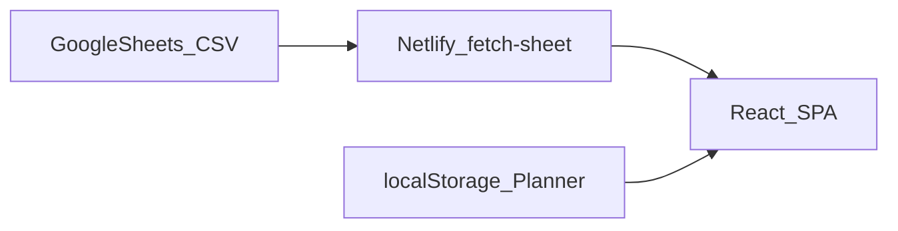
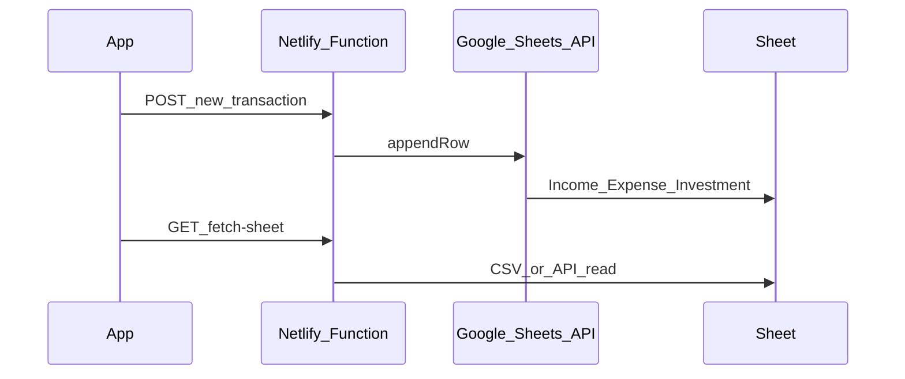

# Future Upgrades — My Finance Dashboard PWA

Detailed product and engineering roadmap for evolving this app beyond the current read-only Google Sheets PWA. Use this document when prioritizing work, writing tickets, or updating the main [README](../README.md).

**Last updated:** August 2026  
**Status:** Planning only — items below are not implemented unless noted otherwise.

---

## Table of Contents

- [1. Current baseline](#1-current-baseline)
- [2. Guiding principles](#2-guiding-principles)
- [3. Phase 1 — Quick wins](#3-phase-1--quick-wins)
- [4. Phase 2 — Analytics and money habits](#4-phase-2--analytics-and-money-habits)
- [5. Phase 3 — Richer data model](#5-phase-3--richer-data-model)
- [6. Phase 4 — Write path and sync](#6-phase-4--write-path-and-sync)
- [7. Phase 5 — Privacy and access](#7-phase-5--privacy-and-access)
- [8. Phase 6 — Stretch / long-term](#8-phase-6--stretch--long-term)
- [9. Suggested priority order](#9-suggested-priority-order)
- [10. What not to do early](#10-what-not-to-do-early)
- [11. Success metrics](#11-success-metrics)
- [12. Key code touchpoints](#12-key-code-touchpoints)
- [13. Open decisions log](#13-open-decisions-log)

---

## 1. Current baseline

### What works today

| Area | Behavior |
| --- | --- |
| Data source | Google Sheets published as CSV (combined URL **or** Income / Expense / Investment URLs) |
| Proxy | Netlify Function `netlify/functions/fetch-sheet.js` keeps sheet URLs server-side |
| Parsing | `src/lib/parseSheet.ts` → `Transaction[]` |
| Metrics | `src/lib/metrics.ts` → net worth, liquid, investment breakup, monthly KPIs, growth |
| Home | KPI grid + `ChartModal` (list / pie / line) |
| Planner | What-if rows in browser `localStorage` only (`plannerTransactions`) |
| Ledger | Search, type filter, month / custom date range |
| Monthly | Per-month income / spends / invest / closing liquid / savings % |
| UX extras | Dark/light theme, amount mask, About modal, compact branded header, PWA install |

### Known limitations

- Read-only: no append/edit/delete from the app into Sheets.
- No end-user login; anyone with the Netlify site URL can see computed finances.
- Starting balances and currency live in `src/config.ts` and require a rebuild to change.
- Planner does not sync across devices or write back to Sheets.
- Investments are **contribution sums**, not live market valuations.
- Sheet data is fetched once on app mount (no dedicated refresh control).
- Publish-to-web CSV is privacy-by-obscure-link, not true auth.
- PWA shell can load offline; live KPIs still need the network function / Sheets.

### Architecture (today)

---

## 2. Guiding principles

1. **Keep Google Sheets as the source of truth** as long as it remains the lowest-friction path for personal use.
2. **Ship value without OAuth first** — refresh, cache, budgets, settings, FY views, exports.
3. Treat **write-back and auth as an architecture jump** (new APIs, secrets, consent UX), not a small patch.
4. Prefer features that reuse `Transaction`, `buildFinancialMetrics`, existing tabs, and `ChartModal` patterns.
5. Optimize for **mobile-first INR personal finance**, not multi-tenant SaaS accounting.

---

## 3. Phase 1 — Quick wins

**Goal:** Feel like a live app; reduce rebuild friction; make Planner a useful staging area.  
**Effort:** ~1–2 weeks  
**Architecture change:** None (stay on published CSV + existing function)

### 3.1 Manual / pull-to-refresh

**Problem:** `App.tsx` loads finances once in `useEffect` on mount. After editing Sheets, users must hard-reload the browser.

**Proposal:**

- Extract `loadFinances()` so it can be called on demand.
- Add a refresh control in the header (next to mask / theme / about).
- Optional: quiet auto-refresh every N minutes while the tab is visible.
- Show a brief “Updating…” state; keep previous metrics visible until new data arrives.

**Primary files:** `src/App.tsx`, header controls in same file.

**Acceptance:**

- User can tap Refresh and see updated sheet rows without a full page reload.
- Concurrent refresh does not double-apply stale responses (use abort / request id).

---

### 3.2 Last-known-good transaction cache

**Problem:** On fetch failure, the UI falls back to starting balances only and an amber warning — prior live history disappears.

**Proposal:**

- On every successful fetch, persist `Transaction[]` (+ timestamp) to `localStorage` or IndexedDB.
- On failure, hydrate from cache and change the banner to: “Couldn’t refresh. Showing cached data from &lt;time&gt;.”
- Clear or version the cache key if the CSV schema changes.

**Primary files:** `src/App.tsx`, possibly a small `src/lib/cache.ts`.

**Acceptance:**

- Airplane-mode reopen (after a prior successful load) still shows last Ledger / KPIs from cache.
- Fresh successful fetch replaces the cache.

---

### 3.3 Fetch freshness indicator

**Problem:** Users cannot tell whether numbers are live or stale.

**Proposal:**

- Store `lastFetchedAt` in app state.
- Show a subtle subtitle or chip: `Synced · 2 min ago` (replace or augment “Synced from your Google Sheet”).

**Acceptance:**

- Timestamp updates after each successful refresh.

---

### 3.4 Runtime settings (starting balances / currency)

**Problem:** Changing `INITIAL_*` or `CURRENCY` in `src/config.ts` requires a code change and Netlify rebuild.

**Proposal (preferred for personal fork):**

- Add a Settings screen or modal.
- Persist overrides in `localStorage` (liquid start, investment breakdown, currency symbol/locale).
- Keep `src/config.ts` values as defaults when no override exists.
- Metrics builders should read through a resolver (`getEffectiveConfig()`) instead of importing constants directly where possible.

**Alternative (multi-deploy):** Netlify env JSON (e.g. `SECRET_FINANCE_CONFIG`) returned by a small function — still no rebuild of JS for balance tweaks, but requires redeploy of env.

**Primary files:** `src/config.ts`, `src/lib/metrics.ts`, new settings UI component, `App.tsx`.

**Acceptance:**

- Change starting liquid in Settings → Home net worth / liquid update without redeploying.
- Clearing settings restores code defaults.

---

### 3.5 Planner category autocomplete

**Problem:** Free-text categories drift (`Food` vs `food` vs `Groceries`).

**Proposal:**

- Build a sorted unique category list from sheet transactions (optionally filtered by selected type).
- Offer datalist / suggestion chips in Planner form.

**Primary files:** `src/components/PlannerView.tsx`.

**Acceptance:**

- Typing “Gro” surfaces existing “Groceries” from sheet history.

---

### 3.6 Promote Planner → CSV / clipboard

**Problem:** Planner never reaches Sheets; users retype rows manually.

**Proposal:**

- “Copy as CSV” / “Download CSV” for planner rows (columns matching Income / Expense / Investment or combined template).
- Optional: group by type and produce three snippets for the multi-sheet workbook.

**Acceptance:**

- Pasting the clipboard output into Google Sheets creates valid rows the dashboard can parse after publish refresh.

---

### Phase 1 outcome

Live feel, safer offline, settings without rebuild, Planner as a staging lane into Sheets.

---

## 4. Phase 2 — Analytics and money habits

**Goal:** Move from reporter → coach without changing the backend.  
**Effort:** ~2–4 weeks

### 4.1 Budgets by category / month

**Why:** Ledger and Monthly show what happened; they do not show targets.

**Data options:**

1. New Google Sheet tab `Budgets` with columns: `Category, MonthlyLimit, Notes` — publish CSV; extend `fetch-sheet` + parser.
2. Local-only budgets in Settings / `localStorage` (faster to ship).

**UI:**

- Home or Monthly: progress bars (spent vs limit) for current month.
- Over-budget state in rose tone consistent with expense KPIs.

**Env (if Sheets-backed):** e.g. `SECRET_GOOGLE_SHEETS_URL_BUDGETS`.

**Acceptance:**

- User sets Groceries = 8000; current month grocery spend shows % used.

---

### 4.2 Savings / net-worth goals

**Why:** Growth KPIs exist (`growthSinceStart`, `netWorth`) but no targets.

**Proposal:**

- Goal type: `netWorth` | `liquid` | `monthlySavingsRate`.
- Fields: target amount (or %), optional target date.
- Progress card on Home; optional simple projected-month estimate from `avgMonthlySavings`.

**Acceptance:**

- Goal “Net worth ₹15,00,000” shows progress vs current `metrics.netWorth`.

---

### 4.3 Indian Financial Year (FY) mode

**Why:** Default grouping is calendar `YYYY-MM`; many INR users think in Apr–Mar.

**Proposal:**

- Toggle: Calendar Year vs FY (Apr–Mar).
- Apply to Monthly list ordering/labels and trend charts.
- Persist preference in `localStorage`.

**Primary files:** `src/lib/metrics.ts` (helpers), `MonthlyView`, `ChartModal` series builders.

**Acceptance:**

- April 2026 appears as start of FY 2026–27 when FY mode is on.

---

### 4.4 Richer Monthly drill-down

**Why:** `MonthlyView` is summary cards only; `expensesByCategory` is already computed in `MonthlyKPI` but unused in UI.

**Proposal:**

- Tap a month → bottom sheet / modal with expense pie + transaction list for that month (reuse `ChartModal` / `TransactionList`).

**Acceptance:**

- From Monthly, open “Jan 2026” and see category split + filtered txns.

---

### 4.5 Trends strip

**Why:** Home charts are per-metric; missing a single “how am I doing over time?” glance.

**Proposal:**

- Compact 6–12 month sparklines: income, spends, investment, savings %.
- Place above or below default KPI grid on Home.

---

### 4.6 Recurring detection

**Why:** SIPs / rent look like ordinary rows.

**Proposal:**

- Heuristic: same type + category + amount within tolerance across ≥2 months → “Recurring” badge in Ledger.
- Purely client-side; no Sheet schema change.

---

### 4.7 Export

**Why:** No download path from the app.

**Proposal:**

- Export filtered Ledger as CSV.
- Optional print-friendly “Month summary” HTML/CSS (`window.print`).

---

### Phase 2 outcome

Budgets, goals, FY-aware history, deeper monthly insight, light exports — still Sheets-edited by hand.

---

## 5. Phase 3 — Richer data model

**Goal:** Keep metrics honest as finances get more complex. Still Sheets-first.

### 5.1 Accounts / wallets

- Optional `Account` column on transactions.
- New liquid breakup KPI (Bank / Cash / UPI wallet, etc.).

### 5.2 Transfers

- New type `transfer` (or paired legs) that **does not** count as income or expense.
- Adjusts liquid ↔ investment without inflating savings rate incorrectly.

### 5.3 Cost basis vs market value

- Today `buildInvestmentBreakup` sums contributions (+ initial breakdown from config).
- Add optional `Valuations` sheet: `Holding, AsOf, MarketValue` (or manual overrides in Settings).
- Net worth can offer “At cost” vs “Mark-to-market” toggle.

### 5.4 Tags

- Extra CSV column `Tags` (comma-separated).
- Ledger search includes tags; optional filter chips.

### 5.5 Ingest validation report

- Parsers currently skip bad dates/amounts silently.
- Return `{ transactions, skipped: [...] }` from parse layer.
- Toast: “3 rows skipped” + expandable reject list / download.

### Phase 3 outcome

Cleaner domain model, fewer silent data bugs, optional mark-to-market net worth.

---

## 6. Phase 4 — Write path and sync

**Goal:** Log from the phone without opening Sheets. **Architecture jump.**

Only start when editing Sheets becomes the bottleneck.

### Target flow

### 6.1 Stepping stone — Google Form / Apps Script webhook

**Lowest complexity write path:**

- App POSTs to an Apps Script Web App or prefilled Form endpoint.
- Script appends a row to the correct tab.
- App continues to **read** via published CSV (eventual consistency; refresh after a few seconds).

**Pros:** No OAuth token storage in the browser.  
**Cons:** Weaker auth on the webhook URL; must protect the script deployment.

### 6.2 Full path — Google OAuth + Sheets API

- OAuth client, secure token handling (prefer server-side exchange in Netlify Functions).
- Scopes limited to the single spreadsheet.
- Append (then later update/delete).
- Dual-read: API read **or** keep CSV publish for simplicity.

### 6.3 Planner cloud sync

- Sync planner rows to a `Planner` Sheet tab, or Netlify Blobs keyed by user id.
- Replaces device-only `localStorage` limitation.

### 6.4 Edit / delete from app

- Requires stable row `Id` column in Sheets.
- Without IDs, only append-only is safe.

### Recommendation

Ship **Apps Script / Form append** first; graduate to OAuth only if two-way edit is required.

---

## 7. Phase 5 — Privacy and access

### 7.1 Site gate

**Problem:** README §3.9 — anyone with the Netlify URL sees KPIs.

**Options:**

- Netlify site-wide password (fastest).
- Netlify Identity / gated function that refuses sheet proxy until authenticated.
- Simple PIN unlock stored as hash (weaker; OK for personal shoulder-surfing).

### 7.2 Per-user sheet binding

- One deploy, multiple people: map Identity email → sheet URL set.
- Avoid shipping everyone’s finances behind one shared env var.

### 7.3 Guest / share mode

- Stronger than amount mask: show only percentages and charts, hide absolute ₹.
- Useful for demos or audits without exposing balances.

---

## 8. Phase 6 — Stretch / long-term

| Idea | Notes |
| --- | --- |
| Bank / UPI statement CSV import | Normalize common Indian export formats → Sheet-shaped rows |
| Multi-currency + FX | Extend `CURRENCY` / `useMask`; store original currency + INR amount |
| Live MF / stock quotes | Netlify Function + cache; feed valuations sheet or overlay |
| PWA push notifications | Budget breach, SIP due — needs push subscription + SW beyond current Workbox shell |
| Unit tests | Highest ROI: `parseSheet.ts`, `metrics.ts` |
| CI | GitHub Actions: `npm run build` / `tsc` on PR before Netlify |

---

## 9. Suggested priority order

Default balanced path for this repo:

1. Refresh + cache + last-fetched time  
2. Settings for starting balances / currency (no rebuild)  
3. Budgets + Monthly drill-down + FY toggle  
4. Planner → CSV promote + category autocomplete  
5. Site password / Identity gate  
6. Write-back (Form / Apps Script first)  
7. Valuations / accounts / transfers  
8. Bank import and market quotes  

Re-order if your pain is primarily **privacy** (do #5 earlier) or **phone data entry** (do #6 earlier).

---

## 10. What not to do early

- Replacing Google Sheets with a custom database before a write-back need is proven.
- Adding a heavy chart library before extending `ChartModal.tsx`.
- Bank aggregation / Account Aggregator integrations (cost, compliance) while CSV + Sheets still works.
- Multi-tenant SaaS features (teams, roles, billing) — out of scope for a personal dashboard.

---

## 11. Success metrics

| Phase | Signal you’re done |
| --- | --- |
| **P1** | Sheet edit visible in app in under ~30s without hard browser reload; offline reopen shows last good data |
| **P2** | User can set a grocery budget and see % used for the current month |
| **P3** | Transfers don’t inflate income/spend; skipped CSV rows are visible |
| **P4** | Add an expense from phone and see it in Ledger after one refresh |
| **P5** | Random visitor without credentials cannot see rupee amounts |
| **P6** | CI blocks broken parse/metrics; optional statement import works for one bank format |

---

## 12. Key code touchpoints

| Concern | Location |
| --- | --- |
| App shell / fetch lifecycle | `src/App.tsx` |
| Types | `src/types.ts` |
| Starting balances / currency | `src/config.ts` |
| CSV parse + fetch | `src/lib/parseSheet.ts` |
| Metrics / monthly KPIs | `src/lib/metrics.ts` |
| Home KPIs | `src/components/HomeView.tsx`, `KpiCard.tsx` |
| Charts | `src/components/ChartModal.tsx` |
| Planner | `src/components/PlannerView.tsx` |
| Ledger filters | `src/components/LedgerView.tsx` |
| Monthly list | `src/components/MonthlyView.tsx` |
| Sheet proxy | `netlify/functions/fetch-sheet.js` |
| Deploy / SPA | `netlify.toml`, `vite.config.ts` |
| Templates | `finance_template.csv`, `templates/*.csv` |

---

## 13. Open decisions log

Record choices here when implementation starts (so future-you remembers why).

| Date | Decision | Choice | Rationale |
| --- | --- | --- | --- |
| — | Budgets storage | _TBD: Sheet tab vs localStorage_ | — |
| — | Write-back approach | _TBD: Apps Script vs OAuth_ | — |
| — | Site gate | _TBD: Netlify password vs Identity_ | — |
| — | Cache storage | _TBD: localStorage vs IndexedDB_ | — |

---

## Related docs

- Product + setup + architecture: [README.md](../README.md)
- CSV templates: [`../templates/`](../templates/), [`../finance_template.csv`](../finance_template.csv)
